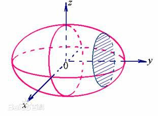

# SVM基础1の拉格朗日乘数

Wiki上拉格朗日乘数的页面在[这里](https://zh.wikipedia.org/wiki/拉格朗日乘数)。

在数学中的最优化问题中，拉格朗日乘数法（以数学家约瑟夫·拉格朗日命名）是一种寻找多元函数在其变量受到一个或多个条件的约束时的极值的方法。这种方法可以将一个有$n$个变量与$k$个约束条件的最优化问题转换为一个解有$n + k$个变量的方程组的解的问题。这种方法中引入了一个或一组新的未知数，即拉格朗日乘数，又称拉格朗日乘子，或拉氏乘子，它们是在转换后的方程，即约束方程中作为梯度（gradient）的线性组合中各个向量的系数。

比如，要求$f(x,y)$在$g(x,y)=c$时的最大值时，我们可以引入新变量拉格朗日乘数$\lambda$，这时我们只需要下列拉格朗日函数的极值：
- $\mathcal{L}(x,y,\lambda)=f(x,y)+\lambda\cdot(g(x,y)-c)$

拉格朗日乘数法所得的极点会包含原问题的所有极值点，但并不保证每个极值点都是原问题的极值点。拉格朗日乘数法的正确性的证明牵涉到偏微分，全微分或链法。

## 1. 定义
微积分中最常见的问题之一是求一个函数的极大极小值（极值）。但是很多时候找到极值函数的显式表达是很困难的，特别是当函数有先决条件或约束时。拉格朗日乘数则提供了一个非常便利方法来解决这类问题，而避开显式地引入约束和求解外部变量。

先看一个二维的例子：假设有函数：$f(x,y)$，要求其极值（最大值/最小值），且满足条件$g(x,y)=c$，其中，$c$为常数。

如下图所示，对于不同的$d_n$的值，不难想像出$f(x,y)=d_n$的的等高线。而方程$g$的可行集所构成的线正好是$g(x,y) = c$。想像我们沿着$g = c$的可行集走；因为大部分情况下$f$的等高线和$g$的可行集线不会重合，但在有解的情况下，这两条线会相交。想像此时我们移动$g = c$上的点，因为$f$是连续的方程，我们因此能走到$f(x,y) = d_n$更高或更低的等高线上，也就是说$d_n$可以变大或变小。只有当$g = c$和$f(x,y)=d_n$相切，也就是说，此时，我们正同时沿着$g = c$和$f(x,y)=d_n$走。这种情况下，会出现极值或鞍点。

*绿线标出的是约束$g(x,y) = c$的点的轨迹。蓝线是$f$的等高线。箭头表示斜率，和等高线的法线平行。*

气象图中就很常出现这样的例子，当温度和气压两列等高线同时出现的时候，切点就意味着约束极值的存在。

用向量的形式来表达的话，我们说相切的性质在此意味着$f$和$g$的切线在某点上平行，同时也意味着两者的梯度平行。此时引入一个未知标量λ，并求解：
- $\nabla[f(x,y)+\lambda(g(x,y)-c)]=0, \lambda\ne0$。

一旦求出$λ$的值，将其套入下式，易求在无约束条件下的极值和对应的极值点：
- $F(x,y,\lambda)=f(x,y)+\lambda(g(x,y)-c)$

方程$F(x,y,\lambda)$在达到极值时与$f(x,y)$相等，因为$F(x,y,\lambda )$达到极值时$g(x,y)-c$总等于零。

## 2. 拉格朗日乘数的运用方法
如$f$定义为在$R_n$上的方程，约束为$g_k(x) = c_k$（或将约束左移得到$g_k(x) − c_k = 0$）。定义拉格朗日$\Lambda$为：
- $\Lambda(x, \lambda)=f+\sum_{k}\lambda_k(g_k-c_k)$

注意极值的条件和约束现在就都被记录到一个式子里了：
- $\nabla\Lambda=0 \Leftrightarrow \nabla f=-\sum_{k}\lambda_k\nabla g_k$
- $\nabla_\lambda=0 \Leftrightarrow g_k=c_k$

拉格朗日乘数常被用作表达最大增长值。原因是从式子：
- $-\frac{\partial\Lambda}{\partial c_k}=\lambda_k$

中我们可以看出$\lambda_k$是当方程在被约束条件下，能够达到的最大增长率。拉格朗日力学就使用到这个原理。

## 3. 拉格朗日乘数例子
### 3.1 求二元二次方程最小值
求方程式$f(x,y)=x^2y$的最小值，同时要满足$x^2+y^2=1$。

因为只有一个未知数的限制条件，我们只需要用一个乘数$\lambda$：
- $g(x,y)=x^2+y^2-1$
- $\Phi(x,y,\lambda)=f(x,y)+\lambda g(x,y)=x^2y+\lambda(x^2+y^2-1)$

将所有$\Phi$方程的偏微分设为零，得到一个方程组，最小值是以下方程组的解中的一个：
- $2xy+2\lambda x=0$
- $x^2+2\lambda y=0$
- $x^2+y^2-1=0$

### 3.2 求椭球内接长方体的最大值
给定椭球：
- $\frac{x^2}{a^2}+\frac{y^2}{b^2}+\frac{z^2}{c^2}=1$

求这个椭球的内接长方体的最大体积。这个问题实际上就是条件极值问题，即在条件$\frac{x^2}{a^2}+\frac{y^2}{b^2}+\frac{z^2}{c^2}=1$下求$f(x,y,z)=8xyz$的最大值。

当然这个问题实际可以先根据条件消去$z$（消元法），然后带入转化为无条件极值问题来处理。但是有时候这样做很困难，甚至是做不到的，这时候就需要用拉格朗日乘数法了。

首先定义拉格朗日函数$F(x)$：
- $F(x,y,z,\lambda)=f(x,y,z)+\lambda\varphi(x,y,z)=8xyz+\lambda(\frac{x^2}{a^2}+\frac{y^2}{b^2}+\frac{z^2}{c^2}-1)$

对$F(x,y,z,\lambda)​$求偏导数：
- $\frac{\partial F(x,y,z,\lambda)}{\partial x}=8yz+\frac{2\lambda x}{a^2}=0$
- $\frac{\partial F(x,y,z,\lambda)}{\partial y}=8xz+\frac{2\lambda y}{b^2}=0$
- $\frac{\partial F(x,y,z,\lambda)}{\partial z}=8xy+\frac{2\lambda z}{c^2}=0$
- $\frac{\partial F(x,y,z,\lambda)}{\partial\lambda}=\frac{x^2}{a^2}+\frac{y^2}{b^2}+\frac{z^2}{c^2}-1=0$

联立前三个方式得到$bx=ay$和$az=cx$，带入第四个方程得到：
- $x=\frac{\sqrt{3}}{3}a$
- $y=\frac{\sqrt{3}}{3}b$
- $z=\frac{\sqrt{3}}{3}c$

带入解得到最大体积为：
- $V_{max}=f(\frac{\sqrt{3}}{3}a, \frac{\sqrt{3}}{3}b, \frac{\sqrt{3}}{3}c)=\frac{8\sqrt{3}}{9}abc$

