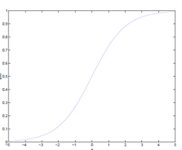
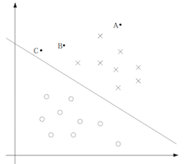
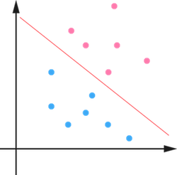
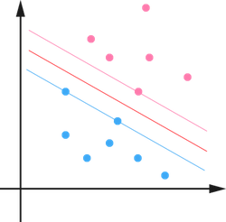
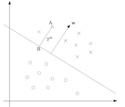
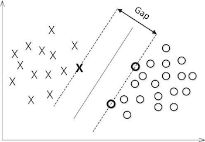
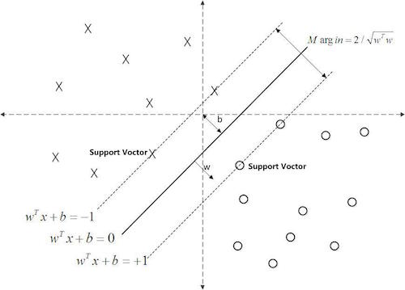
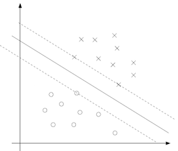
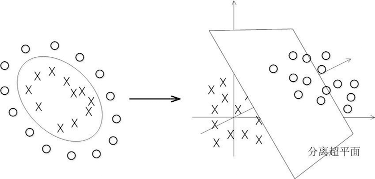

# 理解支持向量机
[TOC]

## 0. 前言
关于支持向量机，来自[wiki](https://zh.wikipedia.org/wiki/支持向量机)的定义如下：

> 在机器学习中，支持向量机(Support Vector Machine，简称为SVM，又名支持向量网络)是在分类与回归分析中分析数据的监督式学习模型与相关的学习算法。给定一组训练实例，每个训练实例被标记为属于两个类别中的一个或另一个，SVM训练算法创建一个将新的实例分配给两个类别之一的模型，使其成为非概率二元线性分类器。SVM模型是将实例表示为空间中的点，这样映射就使得单独类别的实例被尽可能宽的明显的间隔分开。然后，将新的实例映射到同一空间，并基于它们落在间隔的哪一侧来预测所属类别。

除了进行线性分类之外，SVM还可以使用所谓的核技巧有效地进行非线性分类，将其输入隐式映射到高维特征空间中。

参考：

- [支持向量机SVM](http://www.cnblogs.com/jerrylead/archive/2011/03/13/1982639.html)
- [支持向量机通俗导论(理解SVM的三层境界)](http://blog.csdn.net/v_july_v/article/details/7624837)
- [支持向量机系列](http://blog.pluskid.org/?page_id=683)

## 1. 基本原理
支持向量机基本上是最好的可开箱即用的有监督学习算法了。简单来说，SVM是一种二类分类模型，其基本模型定义为特征空间上的间隔最大的线性分类器，其学习策略便是间隔最大化，最终可转化为一个凸二次规划问题的求解。

理解SVM，首先要理解一个概念：线性分类器。我们可以从Logistic回归开始讲解线性分类器，之后引出SVM的概念。

### 1.1 Logistic回归
Logistic回归目的是从特征学习出一个0/1分类模型，而这个模型是将特性的线性组合作为自变量，由于自变量的取值范围是负无穷到正无穷。因此，使用logistic函数（或称作sigmoid函数）将自变量映射到(0,1)上，映射后的值被认为是属于$y=1$的概率。

> **tips**
> 关于sigmoid函数及其原理，参考《Sigmoid函数》

形式化表示就是假设函数
- $h_\theta(x)=g(\theta^Tx)=\frac{1}{1+e^{-\theta^Tx}}$

值得注意的是，其中$x$是n维特征向量，函数$g$就是logistic函数，可以简写成下面的形式：
- $g(z)=\frac{1}{1+e^{-z}}$

$g(z)$函数的图像是

可以看到，$g(x)$将无穷映射到了(0,1)。

如果假设函数就是特征属于y=1的概率，那么有
- $P(y=1 | x; \theta) = h_\theta(x)$
- $P(y=0 | x; \theta) = 1 - h_\theta(x)$

当我们要判别一个新来的特征属于哪个类时，只需求$h_\theta(x)$，若大于0.5就是$y=1$的类，反之属于$y=0$类。

再审视一下$h_\theta(x)$，发现$h_\theta(x)$只和$\theta^Tx$有关，$\theta^Tx > 0$，那么$h_\theta(x) > 0.5$，$g(z)$只不过是用来映射，真实的类别决定权还在$\theta^Tx$。还有当$\theta^Tx \ggg 1$时，$h_\theta(x) = 1$，反之$h_\theta(x)=0$。如果我们只从$h_\theta(x)$出发，希望模型达到的目标无非就是让训练数据中$y=1$的特征$\theta^Tx \ggg 0$，而是$y=0$的特征$\theta^Tx \lll 0$。Logistic回归就是要学习得到$\theta$，使得正例的特征远大于0，负例的特征远小于0，强调在全部训练实例上达到这个目标。

图形化表示如下：

中间那条线是$\theta^Tx = 0$，Logistic回归强调所有点尽可能地远离中间那条线。学习出的结果也就中间那条线。考虑上面3个点A、B和C。从图中我们可以确定A是$\times$类别的，然而C我们是不太确定的，B还算能够确定。这样我们可以得出结论，我们更应该关心靠近中间分割线的点，让他们尽可能地远离中间线，而不是在所有点上达到最优。因为那样的话，要使得一部分点靠近中间线来换取另外一部分点更加远离中间线。我想这就是支持向量机的思路和Logistic回归的不同点，SVM只考虑局部的点（不关心已经确定远离的点），而Logistic回归会考虑全局的点（已经远离的点可能通过调整中间线使其能够更加远离）。

### 1.2 从Logistic回归到SVM
如果对Logistic回归作一个变形，用结果标签1和-1代替Logistic回归中使用的结果标签0和1，并且将$\theta$替换成$w$和$b$。对于Logistic回归有
- $\theta^Tx = \theta_0x_0 + \theta_1x_1 + \theta_2x_2 + ... +  \theta_nx_n$

其中，$x_0=1$。如果将$\theta_0$替换成$b$，$\theta_1, \theta_2, ..., \theta_n$替换成$w_1, w_2, ... , w_n$，得到
- $w^Tx =b + w_1x_1 + w_2x_2 + ... +  w_nx_n = \theta^Tx+b$

因此，
- $h_\theta(x) = g(\theta^Tx) = g(w^Tx+b) = h_{w,b}(x)$

也就是说，SVM和Logistic回归，除了结果标签由1和-1变为0和1、以及标记符号不同外，就没有区别了。

在Logistic回归一节中我们提到只需要关心$\theta^Tx$的正负问题，而不用关心$g(x)$，因此可以对$g(x)$做一个简化，将其简单的映射到$y=1$和$y=-1$上：
- $g(z)=1, z \ge 0$
- $g(z)=-1, z < 0$

### 1.3 函数间隔（functional margin）和几何间隔（geometric margin）
我们看一个二维空间的例子。如下图所示

在这个二维平面上有两种不同的数据，分别用红色和蓝色表示。红颜色的线表示一个可行的超平面，用分类函数$f(x)=w^Tx+b$表示。在进行分类的时候，我们将数据点$x$代入$f(x)$中，如果得到的结果小于0，则赋予其类别-1，如果大于0则赋予类别1。如果$f(x)=0$，则很难办了，分到哪一类都不是。事实上，对于$f(x)$的绝对值很小的情况，我们都很难处理，因为细微的变动（比如超平面稍微转一个小角度）就有可能导致结果类别的改变。理想情况下，我们希望$f(x)$的值都是很大的正数或者很小的负数，这样我们就能更加确信它是属于其中某一类别的。

从几何直观上来说，由于超平面是用于分隔两类数据的，越接近超平面的点越“难”分隔，因为如果超平面稍微转动一下，它们就有可能跑到另一边去。反之，如果是距离超平面很远的点，例如图中的右上角或者左下角的点，则很容易分辩出其类别。

**Tips**
> 需要注意的是，本文中，分类函数$f(x)=w^Tx+b$的$w$和$b$都是向量，后续不再提醒了。

接下来的问题是，如何确定这个超平面呢？从直观上而言，这个超平面应该是最适合分开两类数据的直线。而判定“最适合”的标准就是这条直线离直线两边的数据的间隔最大。所以，要寻找有着最大间隔的超平面。

#### 1.3.1 函数间隔
**Note**
> 文章中将会用到上角标和下角标，如$x_i^{(j)}$，其中下角标$i$表示向量中的第$i$个变量、上角标$j$表示第$i$个变量的第$j$个特征。

给定一个训练样本$(x^{(i)}, y^{(i)})$，$x$是特征，$y$是结果标签，$i$表示第$i$个样本。我们定义函数间隔如下：

- $\hat{\gamma}^{(i)}=y^{(i)}(w^Tx^{(i)}+b)$

可想而知，当$y^{(i)} = 1$时，在我们的$g(z)$定义中，$(w^Tx^{(i)}+b)\ge0$，$\hat{\gamma}^{(i)}$的值实际上就是$|(w^Tx^{(i)}+b)|$，反之亦然。为了使函数间隔最大（具有更大的可置信性确定该测试样例是正例还是反例），当$y^{(i)} = 1$时，$(w^Tx^{(i)}+b)$应该是个大正数，反之则是个大负数。因此函数间隔代表了我们认为特征是正例还是反例的确信度。

继续观察上面的函数间隔定义公式，如果我们同时增大$w$和$b$，比如在$(w^Tx^{(i)}+b)$前面乘个系数（比如乘以2），那么所有点的函数间隔都会增大二倍，这个对求解问题来说不应该有影响，因为我们要求解的是$(w^Tx^{(i)}+b)=0$，同时扩大$w$和$b$对结果是无影响的。这样，我们为了限制$w$和$b$，我们需要加入归一化条件，毕竟求解的目标是确定唯一一个$w$和$b$，而不是多组线性相关的向量。这个归一化一会再考虑。

刚刚我们定义的函数间隔是针对某一个样本的，现在我们定义全局样本上的函数间隔：
- $\hat{\gamma}=\min\limits_{i=1,\dots m} \hat{\gamma}^{(i)}$

即在训练样本上分类正例和负例确信度最小那个函数间隔（函数间隔代表了我们认为特征是正例还是反例的确信度）。

#### 1.3.2 几何间隔
接下来定义几何间隔，如下图所示：

假设我们有了B点所在的分割面$(w^Tx+b)=0$，对于二维平面上的任何其它一点，比如A点，到该面的距离以$\gamma^{(i)}$表示，实际上B点就是A点在分割面上的投影。我们知道向量$\overrightarrow{BA}$的方向是$w$（分割面的梯度），则单位向量是$\frac{w}{\|w\|}$，其中$\|w\|$表示范数，结果为$w$向量的各个元素的平方和的开平方，是线性代数的内容。A点是$(x^{(i)}, y^{(i)})$，所以B点是$x=x^{(i)} - \gamma^{(i)}\frac{w}{\|w\|}$（利用初中的几何知识），带入$(w^Tx^{(i)}+b)=0$得：
1. $w^T(x^{(i)} - \gamma^{(i)}\frac{w}{\|w\|})+b=0$
2. $w^Tx^{(i)} - \gamma^{(i)}\frac{w^Tw}{\|w\|}+b=0$

根据$w^Tw=\|w\|^2$，上面的等式推导如下：
1. $w^Tx^{(i)} - \gamma^{(i)}\|w\|+b=0$
2. $\gamma^{(i)} = \frac{w^Tx^{(i)}+b}{\|w\|}=(\frac{w}{\|w\|})^Tx^{(i)}+\frac{b}{\|w\|}$

$\gamma^{(i)}$实际就是点到直线的距离（参考文章《点到直线的距离》）。

带入标签结果$y_i$，则上面的公式写为：
- $\gamma^{(i)} = y^{(i)}((\frac{w}{\|w\|})^Tx^{(i)}+\frac{b}{\|w\|})=\frac{\hat{\gamma}^{(i)}}{\|w\|}$

当$\|w\| = 1$时，不就是函数间隔吗？是的，前面提到的函数间隔归一化结果就是几何间隔。他们为什么会一样呢？因为函数间隔是我们定义的，在定义的时候就有几何间隔的色彩。同样，同时扩大$w$和$b$，$w$扩大几倍，$\|w\|$就相应扩大几倍，对几何间隔结果无影响。函数间隔和几何间隔实际就差一个缩放因子。

同样，现在我们定义全局样本上的几何间隔如下：
- $\gamma=\min\limits_{i=1,\dots m} \gamma_i$

SVM就是在训练样本上分类正例和负例确信度最小那个函数间隔。

### 1.4 最优间隔分类器（optimal margin classifier）
有些文章将最优间隔分类器（optimal margin classifier）称为最大间隔分类器（maximum margin classifier），但含义是一样的。

对一个数据点进行分类，当超平面离数据点的“间隔”越大，分类的确信度（confidence）也越大。所以，为了使得分类的确信度尽量高，需要让所选择的超平面能够最大化这个“间隔”值。这个间隔就是下图中的`Gap`的一半。

通过由前面的分析可知：函数间隔不适合用来最大化间隔值，因为在超平面固定以后，可以等比例地缩放$w$的长度和$b$的值，这样可以使得的$f(x) = w^Tx+b$值任意大，亦即函数间隔$\hat{\gamma}$可以在超平面保持不变的情况下被取得任意大。但几何间隔$\gamma$因为除上了$\|w\|$，使得在缩放$w$和$b$的时候几何间隔的值是不会改变的，它只随着超平面的变动而变动，因此，这是更加合适分类的间隔。换言之，这里要找的最大间隔分类超平面中的“间隔”指的是几何间隔$\gamma$。

我们形式化表示上述分析如下：
- $max_{\gamma,w,b} \quad \gamma$
- $s.t.$
  - $y^{(i)}(w^Tx^{(i)}+b) \ge \gamma, \quad i = 1,\dots, m$
  - $\|w\| = 1$

这里用$\|w\|$规约$w$，使得$w^Tx+b$是几何间隔。

到此，我们已经将模型定义出来了。如果求得了$w$和$b$，那么来一个特征$x$，我们就能够分类了，称为最优间隔分类器。接下的问题就是如何求解$w$和$b$的问题了。

由于$\|w\| = 1$不是凸函数，我们想先处理转化一下，考虑几何间隔和函数间隔的关系$\gamma=\frac{\hat{\gamma}}{\|w\|}$，我们改写一下上面的式子：
- $max_{\gamma,w,b} \quad \frac{\hat{\gamma}}{\|w\|}$
- $s.t.$
  - $y^{(i)}(w^Tx^{(i)}+b) \ge \hat{\gamma}, \quad i = 1,\dots, m$

这时候其实我们求的最大值仍然是几何间隔，只不过此时的$w$不受$\|w\|=1$的约束了。然而这个时候目标函数仍然不是凸函数，没法直接代入优化软件里计算，还需要继续改写。前面说到同时扩大$w$和$b$对结果没有影响，但我们最后要求的仍然是$w$和$b$的确定值，而不是它们的一组倍数值，因此，我们需要对$\hat\gamma$做一些限制，以保证我们解是唯一的。这里为了简便我们取$\hat\gamma=1$，这样的意义是将全局的函数间隔定义为1，也即是将离超平面最近的点的距离定义为$\frac{1}{\|w\|}$。由于求的$\frac{1}{\|w\|}$最大值相当于求$\frac{1}{2}\|w\|^2$的最小值（前者为后者倒数的导数，带入$\frac{1}{2}$是为了方便求导，对结果没有影响），因此改写后结果为：
- $min_{r,w,b} \quad \frac{1}{2}\|w\|^2$
- $s.t.$
  - $y^{(i)}(w^Tx^{(i)}+b) \ge \hat{\gamma}, \quad i = 1,\dots, m$

为什么要作这样的变换？这是因为变换后，目标函数是二次的、约束条件是线性的，这是个典型的二次规划问题（目标函数是自变量的二次函数），代入现成的QP（Quadratic Programming）优化软件即可求解（一言以蔽之：在一定的约束条件下，目标最优，损失最小）。最终结果如下图所示：

中间的实线便是寻找到的最优超平面（Optimal Hyper Plane），其到两条虚线边界的距离相等，这个距离便是几何间隔，两条虚线间隔边界之间的距离等于$2\hat\gamma$，而虚线间隔边界上的点则是支持向量（support vector）。由于这些支持向量刚好在虚线间隔边界上，所以它们满足$y(w^Tx+b)=1$（还记得我们把函数间隔定为1了吗？），而对于所有不是支持向量的点，则显然有$y(w^Tx+b)>1$。

此外，由于这个问题的特殊结构，还可以通过拉格朗日对偶性（Lagrange Duality）变换到对偶变量（dual variable）的优化问题，即通过求解与原问题等价的对偶问题（dual problem）得到原始问题的最优解，这就是线性可分条件下支持向量机的对偶算法，这样做的优点在于：一者对偶问题往往更容易求解；二者可以自然的引入核函数，进而推广到非线性分类问题。接下来，我们将介绍这种求解方法。

## 2. 深入SVM
在求解SVM之前，我们需要了解关于带约束的最优化问题求解的相关数学知识。这部分内容以《拉格朗日乘数》和《对偶性》为基础，阅读之前务必先完全理解上面的两篇文档。

### 2.1 拉格朗日对偶(Lagrange Duality)
在约束最优化问题中，常常利用拉格朗日对偶性（Lagrange Duality）将原始问题转换为对偶问题，通过解对偶问题而得到原始问题的解。该方法应用在许多统计学习方法中，例如，最大熵模型、及本文介绍的支持向量机。

先不考虑上一节推导出的二次规划问题，先来看看存在等式约束的极值问题求法。

#### 2.1.1 等式约束极值问题
例如下面的带有等式约束的最优化问题：
- $min_{w} \quad f(w)$
- $s.t.$
  - $h_i(w)=0, \quad i = 1,\dots, l.$

其中，$f(w)$是目标函数是，下面是等式约束。通常解法是引入拉格朗日算子，这里使用$\beta$来表示算子，得到拉格朗日公式为：
$\mathcal{L}(w, \beta) = f(w) + \sum_{i=1}^{l}\beta_ih_i(w)$

公式中的$l$是等式约束的个数。

之后，分别对公式中的$w$和$\beta$求偏导，使得偏导数等于0，然后解出$w$和$\beta$。至于为什么引入拉格朗日算子可以求出极值，原因是$f(w)$的$dw$变化方向受其他不等式的约束，$dw$的变化方向与$f(w)$的梯度垂直时才能获得极值，而且在极值处，$f(w)$的梯度与其他等式梯度的线性组合平行，因此他们之间存在线性关系。

#### 2.1.2 不等式约束极值问题
现在可以来看看带有不等式约束的极值问题求解了。例如：
- $min_{w} \quad f(w)$
- $s.t.$
  - $g_i(w) \le 0, \quad i = 1,\dots, k.$
  - $h_i(w) = 0, \quad i = 1,\dots, l.$

我们定义一般化的拉格朗日公式：
$\mathcal{L}(w, \alpha, \beta) = f(w) +\sum_{i=1}^{k}\alpha_ig_i(w) +  \sum_{i=1}^{l}\beta_ih_i(w)$

公式中的$\alpha$和$\beta$都是拉格朗日算子。对这个公式求解是无解的，因为我们求的是最小值，根据问题定义，$g_i(w) \le 0$，当我们将$\alpha_i$设置为一个很大的正数时，带入公式求的了$-\infty$。我们需要排除这种情况，因此，定义下面的函数：
- $\theta_\mathcal{P}(w) = max_{\alpha,\beta: \alpha_i \ge 0}\mathcal{L}(w,\alpha,\beta) ​$

这里的$P$代表primal（原始的、最初的），$\theta_\mathcal{P}(w)$是原始问题，即满足原始的约束条件。假设$g_i(w) > 0$或者$h_i(w) \ne 0$，那么我们总是可以调整$\alpha_i$和$\beta_i$来使得$\theta_\mathcal{P}(w)$有最大值为$\infty$，即求$\theta_\mathcal{P}(w)$的最大值无解。而只有$g(w)$和$h(w)$满足约束时，$\theta_\mathcal{P}(w)$最大值为$f(w)$。这个函数的精妙之处在于$\alpha_i \ge 0$时能够求得极大值。

我们得到结论如下：
- $\theta_\mathcal{P}(w) = \begin{cases} f(w) & \text{if $w$ satisfies primal constraints} \\  \infty & \text{otherwise} \end{cases}$

这样我们原来要求的$min_w f(w)$可以转换成求$min_w\theta_\mathcal{P}(w)$了：
- $min_w\theta_\mathcal{P}(w) = min_w max_{\alpha,\beta: \alpha_i \ge 0}\mathcal{L}(w,\alpha,\beta)$

我们使用$p^*$来表示$min_w\theta_\mathcal{P}(w)$。如果直接求解，首先面对的是两个参数，即$\alpha_i$，也就是不等式约束，以及$w$上求最小值（由于$h_i(w)$为0，因此$\beta_i$可以不考虑）。这个过程不容易做，那么怎么办呢？

我们暂时搁置之前的问题，先来考虑另外一个问题：
- $\theta_{\mathcal{D}}(\alpha, \beta) = min_w\mathcal{L}(w, \alpha, \beta)$

$\mathcal{D}$的意思是对偶，$\theta_{\mathcal{D}}(\alpha, \beta)$将问题转化为先求拉格朗日量关于$w$的最小值，将$\alpha$和$\beta$看作是固定值，之后再求$\theta_{\mathcal{D}(\alpha, \beta)}$的最大值：
- $max_{\alpha,\beta: \alpha_i \ge 0}\theta_{\mathcal{D}}(\alpha, \beta) = max_{\alpha,\beta: \alpha_i \ge 0}min_w\mathcal{L}(w,\alpha,\beta)$

这个问题是原问题的对偶问题，相对于原问题只是更换了$min$和$max$的顺序，而一般更换顺序的结果是$Max Min(X) <= Min Max(X)$，不严格的描述上述公式，即最小值中最大的一个小于等于最大值中最小的一个。然而在这里两者相等。用$d^*$来表示对偶问题如下：
- $d^* = max_{\alpha,\beta: \alpha_i \ge 0}min_w\mathcal{L}(w,\alpha,\beta) \le min_w max_{\alpha,\beta: \alpha_i \ge 0}\mathcal{L}(w,\alpha,\beta) = p^*$

下面解释在什么条件下两者会等价（这里我们直接引用了结论，更详细的讨论参考《对偶性》）。假设$f$和$g$都是凸函数，$h$是仿射的（affine，就是形如Ax+b的形式），并且存在$w$使得对于所有的$i$，$g_i(w)<0$。在这种假设下，一定存在$w^*, \alpha^*, \beta^*$使得$w^*$是原问题的解，$\alpha^*, \beta^*$是对偶问题的解。还有$p^* = d^* = \mathcal{L}(w^*, \alpha^*, \beta^*)$。另外，$w^*, \alpha^*, \beta^*$满足库恩-塔克条件（Karush-Kuhn-Tucker, KKT condition），该条件如下：
$(1) \quad \frac{\theta}{\theta{w_i}}\mathcal{L}(w^*, \alpha^*, \beta^*)=0, i=1,\dots,n$
$(2) \quad \frac{\theta}{\theta{\beta_i}}\mathcal{L}(w^*, \alpha^*, \beta^*)=0, i=1,\dots,l$
$(3) \quad \alpha^*_ig_i(w^*)=0, i=1,\dots, k$
$(4) \quad g_i(w^*) \le 0, i=1,\dots, k$
$(5) \quad \alpha^*  \ge 0, i=1,\dots, k$

所以如果$w^*, \alpha^*, \beta^*$满足了KKT条件，那么他们就是原问题和对偶问题的解。

**重要**
> 让我们再次审视公式（3），这个条件称作是KKT双重补足条件（KKT dual complementarity）。这个条件隐含了如果$\alpha^*>0$，那么$g_i(w)=0$。也就是说，$g_i(w)=0$时，$w$处于可行域的边界上，这时才是起作用的约束。而其他位于可行域内部（$g_i(w)<0$）点都是不起作用的约束，其$\alpha^*=0$。这个KKT双重补足条件会用来解释支持向量和SMO的收敛测试，非常重要，务必理解透彻。

这部分内容思路比较凌乱，可参考《对偶性》一文。KKT的总体思想是将极值会在可行域边界上取得，也就是不等式为0或等式约束里取得，而最优下降方向一般是这些等式的线性组合，其中每个元素要么是不等式为0的约束，要么是等式约束。对于在可行域边界内的点，对最优解不起作用，因此前面的系数为0。

### 2.2 求解最优间隔分类器
了解了关于带有约束条件的最优化问题相关基础理论之后，我们开始讨论关于SVM的优化问题。

SVM的优化问题定义如下：
- $min_{r,w,b} \quad \frac{1}{2}\|w\|^2$
- $s.t.$
  - $y^{(i)}(w^Tx^{(i)}+b) \ge \hat{\gamma}, \quad i = 1,\dots, m$

我们将约束条件改写为：
- $g_i(w)=-y^{(i)}(w^Tx^{(i)}+b)+1 \le 0$

从KKT条件得知只有函数间隔是1（离超平面最近的点）的线性约束式前面的系数$\alpha_i>0$，也就是说这些约束式$g_i(w)=0$，对于其他的不在线上的点($g_i(w)<0$)，极值不会在他们所在的范围内取得，因此前面的系数$\alpha_i=0$。注意每一个约束式实际就是一个训练样本。

参考下面的图示：

实线是最大间隔超平面，假设`x`号的是正例，`o`的是负例。在虚线上的点就是函数间隔是1的点，那么他们前面的系数$\alpha_i > 0$，其他点都是$\alpha_i=0$。这三个点称作支持向量。构造拉格朗日函数如下：
- $\mathcal{L}(w,b,\alpha)=\frac{1}{2}\|w\|^2-\sum_{i=1}^{m}\alpha_i(y^{(i)}(w^Tx^{(i)}+b)-1)$

注意到这里只有$\alpha_i$没有$\beta_i$是因为原问题中没有等式约束，只有不等式约束。

下面我们按照对偶问题的求解步骤来一步步进行。首先要让$\mathcal{L}(w,b,\alpha)$关于$w$和$b$最小化，然后求对$\alpha$的极大值，最后利用SMO算法求解对偶问题中的拉格朗日乘子。

原问题的对偶问题为：
- $d^* = max_{\alpha, \beta: a_i \ge 0} min_w \mathcal{L}(w, \alpha, \beta)$

首先求解$\mathcal{L}(w, \alpha, \beta)$的最小值。对于固定的$\alpha_i$，$\mathcal{L}(w, \alpha, \beta)$的最小值只与$w$和$b$有关。对$w$和$b$分别求偏导数：
- $\frac{\partial}{\partial w} = w - \sum_{i=1}^{m}\alpha_iy^{(i)}x^{(i)}=0$
- $\frac{\partial}{\partial b} = \sum_{i=1}^{m}\alpha_iy^{(i)}=0$

之后可以推导出：
- $w=\sum_{i=1}^{m}a_iy^{(i)}x^{(i)}$

将上式带回到拉格朗日函数中得到，此时得到的是该函数的最小值（目标函数是凸函数）代入后，化简过程如下：
$\mathcal{L}(w,b,\alpha)$
$\quad =\frac{1}{2}\|w\|^2-\sum_{i=1}^{m}\alpha_i[y^{(i)}(w^Tx^{(i)}+b)-1]$

$\quad =\frac{1}{2}w^Tw - \sum_{i=1}^{m}\alpha_iy^{(i)}w^Tx^{(i)} - \sum_{i=1}^{m}\alpha_iy^{(i)}b + \sum_{i=1}^{m}\alpha_i$

$\quad=\frac{1}{2}w^T\sum_{i=1}^{m}\alpha_iy^{(i)}x^{(i)} - \sum_{i=1}^{m}\alpha_iy^{(i)}w^Tx^{(i)} - \sum_{i=1}^{m}\alpha_iy^{(i)}b + \sum_{i=1}^{m}\alpha_i$

$\quad =\frac{1}{2}w^T\sum_{i=1}^{m}\alpha_iy^{(i)}x^{(i)} - w^T\sum_{i=1}^{m}\alpha_iy^{(i)}x^{(i)} - \sum_{i=1}^{m}\alpha_iy^{(i)}b + \sum_{i=1}^{m}\alpha_i$

$\quad =-\frac{1}{2}w^T\sum_{i=1}^{m}\alpha_iy^{(i)}x^{(i)}  - \sum_{i=1}^{m}\alpha_iy^{(i)}b + \sum_{i=1}^{m}\alpha_i$

$\quad =-\frac{1}{2}w^T\sum_{i=1}^{m}\alpha_iy^{(i)}x^{(i)}  - b\sum_{i=1}^{m}\alpha_iy^{(i)} + \sum_{i=1}^{m}\alpha_i$

$\quad =-\frac{1}{2}({\sum_{i=1}^{m}\alpha_iy^{(i)}x^{(i)}})^T\sum_{i=1}^{m}\alpha_iy^{(i)}x^{(i)}  - b\sum_{i=1}^{m}\alpha_iy^{(i)} + \sum_{i=1}^{m}\alpha_i$

$\quad =-\frac{1}{2}{\sum_{i=1}^{m}\alpha_iy^{(i)}(x^{(i)})^T}\sum_{i=1}^{m}\alpha_iy^{(i)}x^{(i)}  - b\sum_{i=1}^{m}\alpha_iy^{(i)} + \sum_{i=1}^{m}\alpha_i$

$\quad =-\frac{1}{2}{\sum_{i=1,j=1}^{m}\alpha_iy^{(i)}(x^{(i)})^T}\alpha_jy^{(j)}x^{(j)}  - b\sum_{i=1}^{m}\alpha_iy^{(i)} + \sum_{i=1}^{m}\alpha_i$

$\quad =\sum_{i=1}^{m}\alpha_i -\frac{1}{2}{\sum_{i=1,j=1}^{m}y^{(i)}y^{(j)}\alpha_i\alpha_j(x^{(i)})^T}x^{(j)}  - b\sum_{i=1}^{m}\alpha_iy^{(i)}$

最后得到：
- $\mathcal{L}(w,b,\alpha) = \sum_{i=1}^{m}\alpha_i -\frac{1}{2}{\sum_{i=1,j=1}^{m}y^{(i)}y^{(j)}\alpha_i\alpha_j(x^{(i)})^T}x^{(j)}  - b\sum_{i=1}^{m}\alpha_iy^{(i)}$

根据上面的偏导数推导公式，最后一项为0，因此上式可以继续简化：
- $\mathcal{L}(w,b,\alpha) = \sum_{i=1}^{m}\alpha_i -\frac{1}{2}{\sum_{i=1,j=1}^{m}y^{(i)}y^{(j)}\alpha_i\alpha_j(x^{(i)})^T}x^{(j)}$

我们将向量内积$(x^{(i)})^Tx^{(j)}$表示为$\langle x^{(i)}x^{(j)} \rangle$：
- $\mathcal{L}(w,b,\alpha) = \sum_{i=1}^{m}\alpha_i -\frac{1}{2}\sum_{i=1,j=1}^{m}y^{(i)}y^{(j)}\alpha_i\alpha_j\langle x^{(i)}x^{(j)} \rangle$

推导到这里，拉格朗日函数只包含了变量$\alpha_i$，我们求出了$\alpha_i$之后就能得到$w$和$b$。

接着是$\alpha$极大化的过程：
- $d^*=max_{\alpha, \beta:\alpha_i \ge 0} min_w \mathcal{L}(w, \alpha, \beta)$

即
- $max_{\alpha}W(\alpha) = \sum_{i=1}^{m}\alpha_i -\frac{1}{2}\sum_{i,j=1}^{m}y^{(i)}y^{(j)}\alpha_i\alpha_j\langle x^{(i)}x^{(j)} \rangle$
- $s.t.$
  - $\alpha_i \ge 0, i = 1, \dots, m$
  - $\sum_{i=1}^{m}\alpha_iy^{(i)}=0$

前面提到过对偶问题和原问题满足的几个条件，首先由于目标函数和线性约束都是凸函数，而且这里不存在等式约束$h$。存在$w$使得对于所有的$i$，$g_i(w)<0$。因此，一定存在$w^*, \alpha^*$使得$w^*$是原问题的解，$\alpha^*$是对偶问题的解。在这里，求$\alpha_i$就是求$\alpha^*$了。

如果求得了$\alpha_i$，根据$w=\sum_{i=1}^{m}a_iy^{(i)}x^{(i)}$，即可求出$w$（也就是$w^*$，原问题的解）；之后带入$b^*=-\frac{max_{i:y^{(i)}=-1}(w^*)^Tx^{(i)}+min_{i:y^{(i)}=1}(w^*)^Tx^{(i)}}{2}$，可求出b，即离超平面最近的正的函数间隔要等于离超平面最近的负的函数间隔。

关于上面的对偶问题如何求解，将留给下一篇中的SMO算法来阐明。

### 2.3 线性不可分的情况
为过渡到核函数，让我们考虑另外一个问题。首先就是关于"超平面"的，当我们对一个数据点$x$进行分类，实际上是通过把$x$带入到$f(x) = w^Tx+b$算出结果然后根据其正负号来进行类别划分的。而在前面的推导中我们得到公式：
- $w=\sum_{i=1}^{m}a_iy^{(i)}x^{(i)}$

带入分类函数得到：
$f(x) = (\sum_{i=1}^{m}a_iy^{(i)}x^{(i)})^Tx+b$
$\quad\quad=\sum_{i=1}^{m}y^{(i)}\alpha_i\langle x^{(i)}x\rangle+b$

也就是说，以前新来的要分类的样本首先根据$w$和$b$做一次线性运算，然后看求的结果是大于0还是小于0，来判断正例还是负例。现在有了$\alpha_i$，我们不需要求出$w$，只需将新来的样本和训练数据中的所有样本做内积和即可。那有人会说，与前面所有的样本都做运算是不是太耗时了？其实不然，我们从KKT条件中得到，只有支持向量的$\alpha_i>0$，非支持向量的情况下$\alpha_i=0$。因此，我们只需求新来的样本和支持向量的内积，然后运算即可。这种写法为下面要提到的核函数（kernel）做了很好的铺垫。

为什么非支持向量对应的等于零呢？直观上来理解的话，就是超平面后方的点对超平面是没有影响的，分类完全有超平面决定。所以，这些无关的点并不会参与分类问题的计算，因而也就不会产生任何影响了。

从公式上我们也可以推导相同的结论。参考之前的拉格朗日公式：
- $\mathcal{L}(w,b,\alpha)=\frac{1}{2}\|w\|^2-\sum_{i=1}^{m}\alpha_i\color{red}{(y^{(i)}(w^Tx^{(i)}+b)-1)}$

注意到如果$x^{(i)}$是支持向量的话，上式中红颜色的部分是等于 0 的（因为支持向量的函数间隔等于1）；而对于非支持向量来说，函数间隔会大于1，因此红颜色部分是大于零的，而又是非负的，为了满足最大化，$\alpha_i$必须等于 0 。这也就是这些非Supporting Vector的点的局限性。 

以上所有这些内容，便得到了一个`maximum margin hyper plane classifier`，这就是所谓的支持向量机（Support Vector Machine）。当然，到目前为止，我们推导出的SVM还比较弱，只能处理线性的情况，不过，在得到了对偶形式之后，通过核函数（Kernel）推广到非线性的情况就变成了一件非常容易的事情了。正如之前所说的，通过求解对偶问题得到最优解，这就是线性可分条件下支持向量机的对偶算法，这样做的优点在于：一者对偶问题往往更容易求解；二者可以自然的引入核函数，进而推广到非线性分类问题。

## 3. 核函数
核函数的引入基于这样两个问题和解决方案：
1. SVM显然是线性分类器，但数据如果根本就线性不可分怎么办？解决方案：数据在原始空间（称为输入空间）线性不可分，但是映射到高维空间（称为特征空间）后很可能就线性可分了
2. 映射到高维空间同时带来一个问题：在高维空间上求解一个带约束的优化问题显然比在低维空间上计算量要大得多，这就是所谓的“维数灾难”。解决方案：于是就引入了“核函数”，核函数的价值在于它虽然也是讲特征进行从低维到高维的转换

### 3.1 核函数应用场景
现实中，大多数时候数据并不是线性可分的，因此，将数据分类的超平面就根本不存在。在之前的推导中，我们已经了解到可以通过SVM寻找线性可分数据的超平面，那么对于非线性的数据SVM是否能够处理？如果能处理，又该怎样处理呐？

这里我们先给出结论：对于非线性数据，SVM 的处理方法是选择一个核函数$K(,)$，通过将线性不可分的数据从低维度映射到高维度空间，来解决数据在原始空间中线性不可分的问题。

具体来说，当数据是线性不可分的时候，SVM首先在低维空间中完成计算，然后通过核函数（Kernels）将输入数据从低维度特征空间映射到高维度特征空间，最终在高度维特征空间中构造出最优分离超平面，从而把平面上本身不好分的非线性数据分开。如下图所示，一堆数据在二维空间无法划分，从而映射到三维空间里划分：

在房地产销售的过程中，我们假设房子的特征是面积，用$x$表示，$x$是实数；房子的价格是结果，用$y$表示。假设我们从样本点的分布中看到$x$和$y$符合3次曲线，那么我们希望使用$x$的三次多项式来逼近这些样本点。那么首先需要将特征$x$扩展到三维$(x, x^2, x^3)$，然后寻找特征和结果之间的模型。我们将这种特征变换称作特征映射（feature mapping），映射函数称作$\phi$，在这个例子中，映射函数表示如下：
- $\phi(x) = \begin{bmatrix} x  \\ x^2 \\ x^3  \end{bmatrix}$

### 3.2 核函数定义
我们希望将得到的特征映射后的特征应用于SVM分类，而不是最初的特征。这样，我们需要将前面$f(x) = w^Tx+b$公式中的内积从$\langle x^{(i)},x \rangle$，映射到$\langle \phi(x^{(i)}), \phi(x) \rangle$。

至于为什么需要映射后的特征而不是最初的特征来参与计算，上面提到的为了更好地拟合是其中一个原因，另外的一个重要原因是样例可能存在线性不可分的情况，而将特征映射到高维空间后，往往就可分了。（在《数据挖掘导论》Pang-Ning Tan等人著的《支持向量机》那一章有个很好的例子说明）

将核函数形式化定义，如果原始特征内积是$\langle x,z \rangle$，映射后$\langle \phi(x), \phi(z) \rangle$，那么定义核函数（Kernel）为：
- $K(x,z) = \phi(x)^T\phi(z)$

这里$\phi$是从输入空间到内积特征空间的映射。

到这里，我们可以得出结论，如果要实现该节开头的效果，只需先计$\phi(x)$，然后计算$\phi(x)^T\phi(z)$即可，然而这种计算方式是非常低效的。比如最初的特征是$n$维的，我们将其映射到$n^2$维，然后再计算，这样需要$O(n^2)$的时间。那么我们能不能想办法减少计算时间呢？

先看一个例子，假设$x$和$z$都是n维的：
- $K(x,z) = (x^Tz)^2$

展开后得到：
$K(x,z)=(x^Tz)^2=(\sum_{i=1}^{n}x_iz_i)(\sum_{j=1}^{n}x_jz_j)=\sum_{i=1}^{n}\sum_{j=1}^{n}(x_ix_j)(z_iz_j)=\phi(x)^T\phi(z)$

这个时候发现我们可以只计算原始特征$x$和$z$内积的平方（时间复杂度是$O(n)$），就等价与计算映射后特征的内积。也就是说我们不需要花$O(n^2)$时间了。

现在看一下当$n=3$时的映射函数，根据上面的公式，得到：
- $\phi(x) = \begin{bmatrix} x_1x_1  \\  x_1x_2  \\  x_1x_3  \\  x_2x_1  \\  x_2x_2  \\  x_2x_2  \\ x_3x_1  \\ x_3x_2  \\ x_3x_3  \end{bmatrix}$

也就是说核函数$K(x,z) = (x^Tz)^2$只能在选择这样的$\phi$作为映射函数时才能够等价于映射后特征的内积。

再看一个核函数：
- $K(x,z)=(x^Tz+c)^2=\sum_{i,j=1}^{n}(x_ix_j)(z_iz_j) + \sum_{i=1}^{n}(\sqrt{2c}x_i)(\sqrt{2c}z_i)+c^2$

当$n=3$时，对应的映射函数为：
- $\phi(x) = \begin{bmatrix} x_1x_1  \\  x_1x_2  \\  x_1x_3  \\  x_2x_1  \\  x_2x_2  \\  x_2x_2  \\ x_3x_1  \\ x_3x_2  \\ x_3x_3  \\ \sqrt{2c}x_1 \\ \sqrt{2c}x_2 \\ \sqrt{2c}x_3 \\ c  \end{bmatrix}$

更一般地，核函数$K(x,z)=(x^T+c)^d$对应的映射后特征维度为$\begin{pmatrix} n+d \\ d \end{pmatrix}$。

由于计算的是内积，我们可以想到IR中的余弦相似度，如果$x$和$z$向量夹角越小，那么核函数值越大，反之，越小。因此，核函数值是$\phi(x)$和$\phi(z)$的相似度。

再看另外一个核函数：

