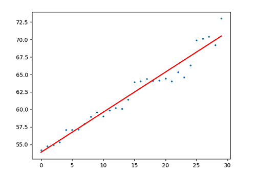

# 最小二乘法的矩阵公式的推导

## 1. 线性回归
线性回归是利用数理统计中回归分析，来确定两种或两种以上变量间相互依赖的定量关系的一种统计分析方法。

直观地说，在二维情况下，已知一些点的$X,Y$坐标，统计条件$X$与结果$Y$的关系，画一条直线，让直线离所有点都尽量地近（距离之和最小），用直线抽象地表达这些点，然后对新的$X$预测新的$Y$。

线性回归的优点是理解和计算都相对简单，缺点是无法解决非线性问题。最小二乘法是实现线性回归的一种具体方法。

## 2. 最小二乘法原理
最小二乘法（ordinary least squares，简称OLS）的核心就是保证所有数据偏差的平方和最小（“平方”的在古时侯的称谓为“二乘”）。

最小二乘法的模型可以写为：

+ $\hat{y}_{i} = w_{1}x_{i1} + w_{2}x_{i2} + ... + w_{k}x_{ik} + e_{i} ,   1\le i\le n,   k\ge 1$

其中，$x_i$表示输入的特征特征向量、$\hat{y}_i$表示根据模型预测的标签向量、$w_i$是每个维度特征的斜率、$e_i$是每个维度特征的截距。

用矩阵形式表示上面的公式，其中$\hat{y}$表示预测的值向量、$W$表示模型参数向量、$X$表示特征矩阵、$e$表示error：

+ $\hat{y} = W^TX + e$
+ $\left[ \begin{matrix} \hat{y}_{1}\\   \hat{y}_{2}\\   \vdots \\   \hat{y}_{n}\\ \end{matrix} \right] =  \left[ \begin{matrix} x_{11}&  x_{12}&  \cdots &  x_{1k}\\      x_{21}&  x_{22}&  \cdots &  x_{2k}\\      \vdots &  \vdots &  \ddots &  \vdots \\     x_{n1}&  x_{n2}&  \cdots &  x_{nk}\\ \end{matrix} \right] \left[ \begin{matrix} w_{1}\\   w_{2}\\   \vdots \\   w_{k}\\ \end{matrix} \right] +  \left[ \begin{matrix} e_{1}\\   e_{2}\\   \vdots \\   e_{n}\\ \end{matrix} \right]$

方便起见，我们用$\alpha$表示参数向量，即$\hat{y} = XW^T + e = X\alpha+e$。假设$y$是特征的真实标签，则预测值和真实值之间的偏差为$y-\hat{y} = y - X\alpha -e$，当向量$e$尽量小的时候，预测值和真实值越接近，即$e$的长度是我们优化的目标：

+ $|e| = \sqrt { \sum ^{n}_{i=1}e_{i}^{2} }$

我们把求平方根运算转换为平方：

+ $|e|^{2} = \sum ^{n}_{i=1}e_{i}^{2} = ee = e^{T}e$

即：当$e^{T}e$取得最小值时，$W$能取得最优解。

## 3. 公式推导
由上文可知：

+ $e = \hat{y} - X\alpha$
+ $e^{T} = (\hat{y} - X\alpha)^{T}$
+ $e^{T}e  = (\hat{y} - X\alpha)^{T}(\hat{y} - X\alpha)$
+ $\   \     = (\hat{y}^{T} - \alpha^{T}X^{T})(\hat{y} - X\alpha)$
+ $\   \     = \hat{y}^{T}\hat{y} - \alpha^{T}X^{T}\hat{y} - \hat{y}^{T}X\alpha + \alpha^{T}X^{T}X\alpha$

上式中重要的是中间的2个子项是可以合并的。首先，仔细观察$\alpha^{T}X^{T}\hat{y}$这个子项，发现它是一个值，一个数值可认为是一个1维的方阵，1维方阵的转置矩阵是它本身。那么就有：

+ $\alpha^{T}X^{T}\hat{y}  = (\alpha^{T}X^{T}\hat{y})^{T} = \hat{y}^{T}(\alpha^{T}X^{T})^{T} = \hat{y}^{T}(X\alpha) = \hat{y}^{T}X\alpha$

所以上面的方程可变为：

+ $e^{T}e = \hat{y}^{T}\hat{y} - 2\hat{y}^{T}X\alpha + \alpha^{T}X^{T}X\alpha$

如何让$e^{T}e$取得最小值？此时需要使用矩阵微分求解。

## 4. 矩阵微分
### 4.1 矩阵微分公式
设：
$\vec{y} = A \vec{x}$ 

其中，$y$是一个$m×1$的矩阵，$A$是一个$m×n$的矩阵，$x$是一个$n×1$的矩阵。则有：
$\frac{\partial{\vec{y}}}{\partial{\vec{x}}} =A  \    \ 【公式1】$

这是如何得到的呢？实际上超级简单，上面这个式子指的是，$\vec{y}$的每一个分量对$\vec{x}$的每一个分量的微分，结果显然就是一个$m×n$矩阵。

### 4.2 扩展公式
设：
$F = \vec{y}^TA\vec{x}$

则有：
+ $\frac{\partial F }{\partial \vec{x}} = \vec{y}^{T}A   \   \  【公式2】$
+ $\frac{\partial F}{\partial \vec{y}} = \vec{x}^{T}A^{T}   \   \   【公式3】$

设：
$F = \vec{x}^{T}A\vec{x}$

且A是对称矩阵，则有：
+ $\frac{\partial F}{\partial \vec{x}} = 2\vec{x}^{T}A     \     \   【公式4】$

### 4.3 应用矩阵微分公式
利用矩阵微分方程求解下列等式：
+ $e^{T}e = \hat{y}^{T}\hat{y} - 2\hat{y}^{T}X\alpha + \alpha^{T}X^{T}X\alpha$

对等号右边的式子求关于$\alpha$的微分，得到：
+ $\frac{\partial \hat{y}^{T}\hat{y}}{\partial \alpha} - 2\frac{\partial \hat{y}^{T}X\alpha}{\partial \alpha} + \frac{\partial \alpha^{T}X^{T}X\alpha}{\partial \alpha}$

当这个式子(导数)等于$0$时, 就得到了$e^{T}e$的最小值。显然，第一个子项为0，所以可把它去掉，得到：
-2\frac{\partial \hat{y}^{T}X\alpha{\partial \alpha} + \frac{\partial \alpha^{T}X^{T}X\alpha}{\partial \alpha}  = 0
+ $-2 \frac{\partial \hat{y}^TX\alpha}{\partial \alpha} + \frac{\partial \alpha^TX^TX\alpha}{\partial \alpha} = 0$
+ $2 \frac{\partial \hat{y}^TX\alpha}{\partial \alpha} = \frac{\partial \alpha^TX^TX\alpha}{\partial \alpha}$

观察左边的式子，和上文的【公式2】是一样的，所以有：
+ $2\frac{\partial \hat{y}^{T}X\alpha}{\partial \alpha} = 2\hat{y}^{T}X$

观察右边的式子，符合上文的【公式4】，所以有：
+ $\frac{\partial \alpha^{T}X^{T}X\alpha}{\partial \alpha} = 2\alpha^{T}X^{T}X$

综上，得：
+ $2\hat{y}^{T}X = 2\alpha^{T}X^{T}X$
+ $\hat{y}^{T}X = \alpha^{T}X^{T}X$
+ $(\hat{y}^{T}X)^T =(\alpha^{T}X^{T}X)^T$
+ $X^{T}\hat{y} = X^{T}X\alpha$

最终得到：
+ $\alpha = (X^TX)^{-1}X^T\hat{y}$

这个公式就是所谓的最小二乘估计(Least Squares Estimator)了。

