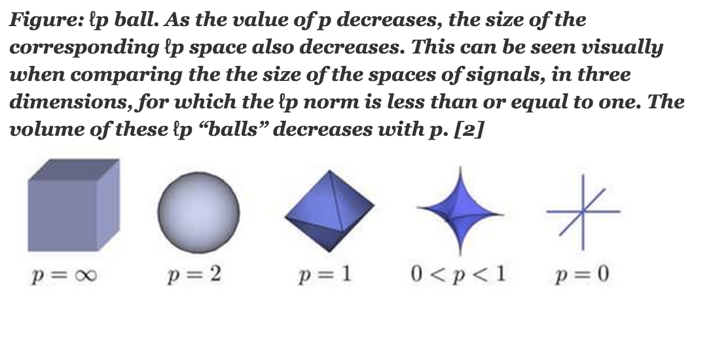

# $L1、L2$正则化
所有的机器学习监督学习算法都可以归结为一句话：“minimize your error while regularizing your parameters”，即在规则化参数的同时最小化误差。最小化误差是为了让我们的模型尽可能拟合我们的训练数据，而规则化参数则是防止我们的模型过分拟合我们的训练数据。

从算法的角度看，如果参数太多，会导致我们的模型复杂度上升，也就是我们的训练误差会很小；但训练误差小并不是我们的最终目标，训练误差下容易导致过拟合。我们的目标是希望模型的测试误差小，也就是能准确的预测新的样本。所以，我们需要保证模型“简单”的基础上最小化训练误差，这样得到的参数才具有好的泛化性能（也就是测试误差也小），而模型“简单”就是通过规则函数来实现的。换句话说，规则化符合奥卡姆剃刀(Occam's razor)原理：在所有可能选择的模型中，我们应该选择能够很好地解释已知数据并且十分简单的模型。

另外，规则项的使用还可以约束我们的模型的特性。这样就可以将人对这个模型的先验知识融入到模型的学习当中，强行地让学习到的模型具有人想要的特性，例如稀疏、低秩、平滑等等。

## 1. 从经验风险最小化到结构经验最小化
机器学习里的损失函数（代价函数）可以用来描述模型与真值（ground truth）之间的差距，因此可以解决“偏差”的问题。但是仅有损失函数，我们无法解决方差的问题，因而会有过拟合风险。$L1$正则项和$L2$正则项正好是损失函数的反面，通过引入正则项使机器学习模型避免过拟合。

经验风险最小化（empirical risk minimization，ERM）认为经验风险最小的模型是最优的模型，即求解最优化问题：

- $\underset{f\in\mathscr{F}}{\min}\frac{1}{N}\sum_{i=1}^N{L\left(y_i,f\left(x_i\right)\right)}$

其中，$y_i$是真实值，$f(x_i)$是根据模型算出来预测值，$L()$是损失函数，$N$是特征值的个数。

当样本容量足够大的时候，经验风险最小化学习效果良好。比如极大似然估计，当模型是条件概率分布，损失函数是对数损失函数时，经验风险最小化就等价于极大似然估计。

但是当样本容量很小时，经验风险最小化学习会产生过拟合（over-fitting）的现象。这就引出了结构风险最小化，它等价于正则化（regularization）。结构风险在经验风险上加上表示模型复杂度的正则化项（regularizer）或罚项（penalty term），它的定义为：

- $R_{srm}(f)=\frac{1}{N}\sum_{i=1}^N{L(y_i,f(x_i;w_i))}+\lambda \Omega(w_i)$

其中$\Omega(w_i)$为模型的复杂度，模型参数越复杂，复杂度$\Omega(w_i)$就越大；反之，模型越简单，复杂度$\Omega(w_i)$就越小，即复杂度表示了对复杂模型的惩罚。$\lambda ≥0$是系数，用以权衡经验风险和模型复杂度。结构风险小需要经验风险和模型复杂度同时小。结构风险小的模型往往对训练数据以及未知的测试数据都有较好的预测。比如贝叶斯估计中的最大后验概率估计就是结构风险最小化的一个例子。当模型是条件概率分布、损失函数是对数损失函数、模型复杂度由模型的先验概率表示时，结构风险最小化就等价于最大后验概率估计。

结构风险最小化的策略认为结构风险最小的模型是最优的模型，求解最优模型即求解最优化问题：

- $\min_{f\in\mathscr{F}}\frac{1}{N}\sum_{i=1}^N{L(y_i,f(x_i))}+\lambda \Omega(w_i)$

这样，监督学习问题变成了经验风险或结构风险函数的最优化问题。上式中，第一项是经验风险， 衡量我们的模型（分类或者回归）的预测值和真实值之前的误差；第二项是正则化项，也就是对参数$w$的规则化函数$\Omega(w)$去约束我们的模型尽量的简单。

在机器学习领域，你会发现，大部分带参模型都和这个公式不但形似，而且神似。其实大部分算法无非就是变换这两项而已。对于第一项Loss函数，如果是Square loss，那就是最小二乘了；如果是Hinge Loss，那就是著名的SVM了；如果是exp-Loss，那就是牛逼的 Boosting了；如果是log-Loss，那就是Logistic Regression了；还有等等。不同的loss函数，具有不同的拟合特性，这个也得就具体问题具体分析的。但这里，我们先不究Loss函数的问题，我们把目光转向“规则项$\Omega(w)$”。

规则化函数也有很多种选择，一般是模型复杂度的单调递增函数，模型越复杂，规则化值就越大。比如，规则化项可以是模型参数向量的范数。然而，不同的选择对参数$w$的约束不同，取得的效果也不同，但我们在论文中常见的都聚集在：0范数、1范数、2范数、迹范数、Frobenius范数和核范数等等。这么多范数，到底它们表达啥意思？具有什么能力？应用场景是什么？接下来我们将关注几个范数的定义、含义和应用场景。

## 2. 范数定义
在线性代数、函数分析等数学分支中，范数（Norm）是一个函数，其赋予某个向量空间（或矩阵）中的每个向量以长度或大小。

在实数域中，数的大小和两个数之间的距离是通过绝对值来度量的。在解析几何中，向量的大小和两个向量之差的大小是“长度”和“距离”的概念来度量的。为了对矩阵运算进行数值分析，我们需要对向量和矩阵的“大小”引进某种度量，即范数。所以，范数是具有“长度”概念的函数。范数是绝对值概念的自然推广。

**范数的定义如下**：
如果向量$x \in R^n$的某个实值函数$f(x) = ||x||$满足：
1. 正定性：$||x||\ge 0$，且$||x||=0$当且仅当x=0
2. 齐次性：对任意实数$c$，都有$||c x||=|c| ||x||$
3. 三角不等式：对任意$x,y \in R^n$，都有$||x+y||\le||x||+||y||$

则称$||x||$为$R^n$上的一个向量范数。

在这里，我们需要关注的最主要是范数的`非负性`。我们刚才讲，损失函数通常是一个有下确界的函数。而这个性质保证了我们可以对损失函数做最优化求解。如果我们要保证目标函数依然可以做最优化求解，那么我们就必须让正则项也有一个下界。非负性无疑提供了这样的下界，而且它是一个下确界——由齐次性保证（当$c=0$时）。

因此，我们说，范数的性质使得它天然地适合作为机器学习的正则项。而范数需要的向量，则是机器学习的学习目标——参数向量。

范数的一般化定义：设$p \ge 1$的实数，$p−norm$定义为：

- $||x||_p:=(\sum_{i=1}^n|x_i|^p)^{\frac{1}{p}}  \ \ \  \ （1）$

机器学习中有几个常用的范数，分别是：
- $L_1$范数：$||\vec{x}||=∑^d_{i=1}| x_i|​$
- $L_2$范数：$||\vec{x}||_2=(∑^d_{i=1}x^2_i)^{1/2}$
- $L_p$范数：$||\vec{x}||_p=(\sum_{i=1}^n|x_i|^p)^{\frac{1}{p}}$
- $L_\infty$范数：$||\vec{x}||_\infty=lim_{p→+∞}(∑^d_{i=1}x^p_i)^{1/p}$

当$p=1$时，我们称之为$taxicab-Norm$，也叫$Manhattan-Norm$。其来源是曼哈顿的出租车司机在四四方方的曼哈顿街道中从一点到另一点所需要走过的距离。也即我们所要讨论的$L_1$范数。其表示某个向量中所有元素绝对值的和。

而当$p=2$时，则是我们最为常见的$Euclidean-norm$，也称为$Euclidean-distance$，也是我们要讨论的$L_2$范数。

而当$p=0$时，因其不再满足三角不等性，严格的说此时$p$已不算是范数了，但很多人仍然称之为$L_0$范数，即$||\vec{x}||_0=\sum_{i=1}^n(x_i \ne 0)$。 

下图给出了一个$L_p$球的形状随着P的减少的可视化图：

在机器学习中，如果使用了$||\vec{w}||_p$作为正则项作为正则项，则我们说，该机器学习任务引入了$L_p$正则项。

## 3. $L_0$与$L_1$正则项（LASSO regularizer）
在机器学习里，最简单的学习算法可能是所谓的线性回归模型：
- $F(\vec{x}; \vec{w} ,b) = \sum_{i=1}^nw_i⋅x_i+b$

我们考虑这样一种普遍的情况，即：预测目标背后的真实值，可能只和某几个维度的特征有关；而其它维度的特征，要不就是作用非常小，要不纯粹就是噪声。在这种情况下，除了这几个维度的特征对应的参数之外，其它维度的参数应该为零。若不然，则当其它维度的特征存在噪音时，模型的行为会发生预期之外的变化，导致过拟合。

于是，我们得到了避免过拟合的第一个思路：使尽可能多的参数为零。为此，最直观地我们可以引入$L_0$范数。令：
- $\Omega(F(\vec{x} ; \vec{w}))\overset{def}= \ell_0\frac{\lVert \vec{w} \rVert_0}{n},\   \   \  \ell_0>0$

这意味着，我们希望绝大多数$\vec{w}$的分量为零。

$L_0$范数的定义是求向量中非$0$元素的个数。这是一种比较强的条件。那么这么做的目的是什么呢？我们知道，如果模型能够帮我们筛选哪些特征是重要的，哪些特征是可以忽略的，那将是我们想要的结果。而$L_0$范数的优化目的就是让向量中的更多参数趋近于$0$，这样可以保留重要的参数，不重要的对应的权重设置为$0$。所以说$L_0$范数主要用来做特征选择。

通过引入$L_0$正则项，我们可以使模型稀疏化且易于解释，并且在某种意义上实现了「特征选择」。这看起来很美好，但是$L_0$正则项也有绕不过去坎：
+ 非连续
+ 非凸
+ 不可求导

因此，$L_0$正则项虽好，但是求解这样的最优化问题，难以在多项式时间内找到有效解（NP-Hard 问题）。于是，我们转而考虑$L_0$范数最紧的凸放松（tightest convex relaxation）：$L_1$范数。令：
- $\Omega(F(\vec{x} ;\vec{w}))\overset{def}{=}\ell_1\frac{\lVert \vec{w} \rVert_1}{n},\ell_1\gt 0$

我们来看一下参数更新的过程，有哪些变化。考虑目标函数：
- $Obj(F)=L(F)+\gamma⋅\ell_1\frac{\lVert \vec{w} \rVert_1}{n}$

我们对参数$w_i$求偏导数(*注意，由于$L_1$范数是参数的绝对值，绝对值的导数是分段的，即参数小于0是为-1，大于0时为1，我们用sgn表示这个导数*)：
- $\frac{\partial Obj}{\partial w_i}=\frac{\partial L}{\partial w_i}+\frac{\gamma \ell_1}{n}sgn(w_i)$

因此参数更新的过程为：
$w_i \to w^{'}_i\overset{def}{=}w_i−\eta \frac{\partial L}{\partial w_i}−\eta \frac{\gamma \ell_1}{n}sgn(w_i)$

其中$\eta$为步长，因为$\eta \frac{\gamma \ell_1}{n} > 0$，所以多出的`固定项`$\eta \frac{\gamma \ell_1}{n}sgn(w_i)$使得$w_i \to 0$，实现稀疏化。

> 不失一般性，我们假定：$w_i$等于不为0的某个正的浮点数，学习速率$\eta$为0.5。简化上面的式子，$L_1$权值更新公式为$w_i = w_i - \eta * 1  = w_i - 0.5 * 1$，也就是说权值每次更新都固定减少一个特定的值(比如0.5)，那么经过若干次迭代之后，权值就有可能减少到0，如下图所示：
> 

## 4. $L_2$正则项（ridge regularizer）
让我们回过头，考虑多项式模型，它的一般形式为：
- $F(\vec{x}; \vec{w} ,b) = \sum_{i=1}^nw_i⋅x_i+b$

我们注意到，当多项式模型过拟合时，函数曲线倾向于靠近噪声点。这意味着，函数曲线会在噪声点之间来回扭曲跳跃。这也就是说，在某些局部，函数曲线的切线斜率会非常高（函数导数的绝对值非常大）。对于多项式模型来说，函数导数的绝对值，实际上就是多项式系数的一个线性加和。这也就是说，过拟合的多项式模型，它的参数的绝对值会非常大（至少某几个参数分量的绝对值非常大）。因此，如果我们有办法使得这些参数的值，比较稠密均匀地集中在0附近，就能有效地避免过拟合。

于是我们引入$L_2$正则项，令：
- $\Omega(F(\vec{x}; \vec{w} ))\overset{def}=\ell_2\frac{\lVert \vec{w} \rVert_2 }{2n},\ell_2>0$

因此有目标函数：
- $Obj(F)=L(F)+\gamma⋅\ell_2\frac{\lVert \vec{w} \rVert_2 }{2n}$

对参数$w_i$求偏导数，有
- $\frac{\partial Obj}{\partial w_i}=\frac{\partial L}{\partial w_i}+\frac{\gamma \ell_2}{n}w_i$

参数更新过程如下：
- $w_i \to w^{'}_i\overset{def}{=}w_i−\eta\frac{\partial L}{\partial w_i}−\eta\frac{\gamma\ell_2}{n}w_i=(1−\eta\frac{\gamma\ell_2}n)w_i−\eta\frac{\partial L}{\partial w_i}$

考虑到$\eta\frac{\gamma\ell_2}{n}>0$，因此，引入$L_2$正则项之后，相当于衰减了参数的权重，使参数趋近于0。

> 不失一般性，我们假定：$w_i$等于不为$0$的某个正的浮点数，学习速率$\ell$为$0.5$。可以将参数更新的公式更新为$w_i = w_i - \ell * w_i = w_i - 0.5 * w_i$，也就是说权值每次都等于上一次的$\frac{1}{2}$，那么，虽然权值不断变小，但是因为每次都等于上一次的一半，所以很快会收敛到较小的值但不为0。下图直观的说明了这个变化趋势：
> 

## 5. $L_1$与$L_2$正则项比较
通过前面的分析我们得出结论：
- $L_1$正则项倾向于使得参数稀疏化
- $L_2$正则项倾向于使得参数稠密地接近于0

简单起见，我们只考虑模型有两个参数$w_1$和$w_2$的情形。当我们在二维平面上绘制$L_1$正则项和$L_2$正则项的等值线时得到以下图形：

- 对于$L_1$正则项来说，因为L$L_1$正则项是一组菱形，这些交点容易落在坐标轴上。因此，另一个参数的值在这个交点上就是0，从而实现了稀疏化
- 对于$L_2$正则项来说，因为$L_2$正则项的等值线是一组圆形。所以，这些交点可能落在整个平面的任意位置。所以它不能实现「稀疏化」。但是，另一方面，由于$ (w_1,w_2)$落在圆上，所以它们的值会比较接近。这就是为什么$L_2正则项可以使得参数在零附近稠密而平滑

下图显示了只有两个特征的正则化函数与模型目标函数等高线的图形，两个曲线首次相交的地方就是最优解；而由图可以看到，$L_1$首次相交的位置出现在角的地方的可能性更大，所以产生稀疏解；而$L_2$则不会。

引用周志华《机器学习》的插图：

