# SVM Classifier Algorithm and Implementation in Python with scikit-learn
[Original Text: algorithm](https://dataaspirant.com/2017/01/13/support-vector-machine-algorithm/)
[Original Text: implementation](http://dataaspirant.com/2017/01/25/svm-classifier-implemenation-python-scikit-learn/)

[TOC]

## 1. Algorithm
### 1.1 SVM Classifier Introduction
Hi, welcome to the another post on classification concepts. So far we have talked bout different classification concepts like logistic regression, knn classifier, decision trees .., etc. In this article, we were going to discuss  support vector machine which is a supervised learning algorithm. Just to give why we were so interested to write about Svm as it is one of the powerful technique for Classification, Regression  & Outlier detection with an intuitive model.

Before we drive into the concepts of support vector machine, let’s remember the backend heads of Svm classifier. **Vapnik & Chervonenkis** originally invented support vector machine. At that time, the algorithm was in early stages. Drawing hyperplanes only for linear classifier was possible.

Later in 1992 **Vapnik, Boser & Guyon** suggested a way for building a non-linear classifier. They suggested using kernel trick in SVM latest paper. Vapnik & Cortes published this paper in the year 1995

From then, Svm classifier treated as one of the dominant classification algorithms. In further sections of our article, we were going to discuss linear and non-linear classes. However, Svm is a supervised learning technique. When we have a dataset with features & class labels both then we can use Support Vector Machine. But if in our dataset do not have class labels or outputs of our feature set then it is considered as an unsupervised learning algorithm. In that case, we can use Support Vector Clustering.

Enough of the introduction to support vector machine algorithm. Let’s drive into the key concepts.

### 1.2 How Svm classifier Works?
For a dataset consisting of features set and labels set, an SVM classifier builds a model to predict classes for new examples. It assigns new example/data points to one of the classes. If there are only 2 classes then it can be called as a Binary SVM Classifier.

There are 2 kinds of SVM classifiers:
1. Linear SVM Classifier
2. Non-Linear SVM Classifier

**Svm Linear Classifier:**
In the linear classifier model, we assumed that training examples plotted in space. These data points are expected to be separated by an apparent gap. It predicts a straight hyperplane dividing 2 classes. The primary focus while drawing the hyperplane is on maximizing the distance from hyperplane to the nearest data point of either class. The drawn hyperplane called as a maximum-margin hyperplane.

**SVM Non-Linear Classifier:**
In the real world, our dataset is generally dispersed up to some extent. To solve this problem separation of data into different classes on the basis of a straight linear hyperplane can’t be considered a good choice. For this Vapnik suggested creating Non-Linear Classifiers by applying the kernel trick to maximum-margin hyperplanes. In Non-Linear SVM Classification, data points plotted in a higher dimensional space.

### 1.3 Examples of SVM boundaries
In this section, we will learn about selecting best hyperplane for our classification. We will show data from 2 classes. The classes represented by triangle $\bigtriangleup$ and circle$\bigcirc$.

**Case 1:**
Consider the case in Fig 2, with data from 2 different classes.Now, we wish to find the best hyperplane which can separate the two classes.

Please check Fig 1. on the right to find which hyperplane best suit this use case.In SVM, we try to maximize the distance between hyperplane & nearest data point. This is known as margin.

Since 1st decision boundary is maximizing the distance between classes on left and right. So, our maximum margin hyperplane will be “1st “.

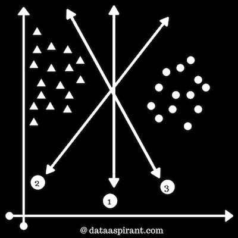

**Case 2:**
Consider the case in Fig 2, with data from 2 different classes.Now, we wish to find the best hyperplane which can separate the two classes.

As data of each class is distributed either on left or right. Our motive is to select hyperplane which can separate the classes with maximum margin.

In this case, all the decision boundaries are separating classes but only 1st decision boundary is showing maximum margin between $\bigtriangleup$ & $\bigcirc$.

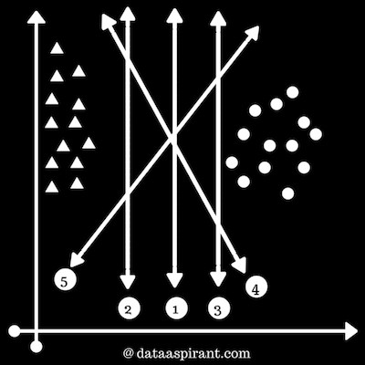

**Case 3:**
Consider the case in Fig 3, with data from 2 different classes. Now, we wish to find the best hyperplane which can separate the two classes.

Data is not evenly distributed on left and right. Some of the $\bigtriangleup$ are on right too. You may feel we can ignore the two data points above 3rd hyperplane but that would be incorrect.

SVM tries to find out maximum margin hyperplane but gives first priority to correct classification.

1st decision boundary is separating some $\bigtriangleup$ from $\bigcirc$  but not all. It’s not even showing good margin.

2nd decision boundary is separating the data points similar to 1st boundary but here margin between boundary and data points is larger than the previous case.

3rd decision boundary is separating all $\bigtriangleup$ from all $\bigcirc$  classes. So, SVM will select 3rd hyperplane.

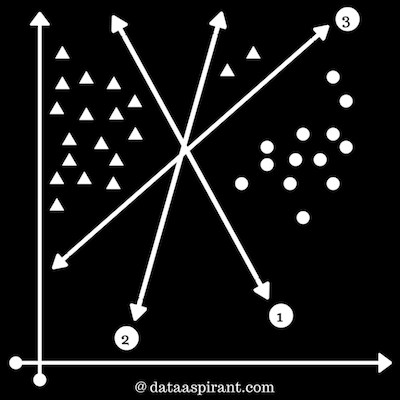

**Case 4:**
Consider the figure 4, we will learn about outliers in SVM.

We wish to find the best hyperplane which can separate the two classes. Data is not evenly distributed on left and right. Some of the $\bigtriangleup$  are on right too.

In the real world, you may find few values that correspond to extreme cases i.e, exceptions. These exceptions are known as Outliers. SVM have the capability to detect and ignore outliers. In the image, 2 $\bigtriangleup \text{'s}$ are in between the group of $\bigcirc$. These $\bigtriangleup \text{'s}$ are outliers.

While selecting hyperplane, SVM will automatically ignore these $\bigtriangleup \text{'s}$ and select best-performing hyperplane.1st & 2nd decision boundaries are separating classes but 1st decision boundary shows maximum margin in between boundary and support vectors.

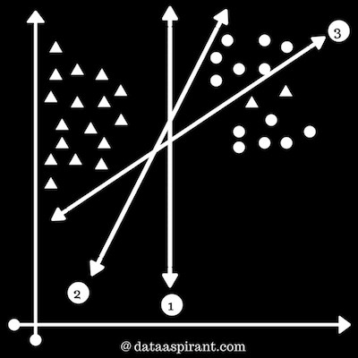

**Case 5: **
We will learn about non-linear classifiers.

Please check the figure 5 on right. It’s showing that data can’t be separated by any straight line, i.e, data is not linearly separable. SVM possess the option of using Non-Linear classifier.

We can use different types of kernels like Radial Basis Function Kernel, Polynomial kernel etc. We have shown a decision boundary separating both the classes. This decision boundary resembles a parabola.

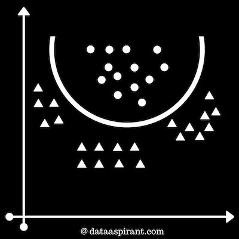

### 1.4 Linear Support Vector Machine Classifier
In Linear Classifier, A data point considered as a p-dimensional vector(list of p-numbers) and we separate points using (p-1) dimensional hyperplane. There can be many hyperplanes separating data in a linear order, but the best hyperplane is considered to be the one which maximizes the margin i.e., the distance between hyperplane and closest data point of either class.

The Maximum-margin hyperplane is determined by the data points that lie nearest to it. Since we have to maximize the distance between hyperplane and the data points. These data points which influences our hyperplane are known as **support vectors**.

### 1.5 Non-Linear Support Vector Machine Classifier
Vapnik proposed Non-Linear Classifiers in 1992.  It often happens that our data points are not linearly separable in a p-dimensional(finite) space. To solve this, it was proposed to map p-dimensional space into a much higher dimensional space. We can draw customized/non-linear hyperplanes using Kernel trick.

Every kernel holds a non-linear kernel function. This function helps to build a high dimensional feature space. There are many kernels that have been developed. Some standard kernels are:
1. **Polynomial (homogeneous) Kernel**
   ${\displaystyle k({\vec {x_{i}}},{\vec {x_{j}}})=({\vec {x_{i}}}\cdot {\vec {x_{j}}})^{d}}$ 
   The polynomial kernel function can be represented by the above expression. Where $k(x_i, x_j)$ is a kernel function, $x_i$ and $x_j$ are vectors of feature space and $d$ is the degree of polynomial function.

2. **Polynomial(non-homogeneous) Kernel**
   $K(x,y) = (x^\mathsf{T} y + c)^{d}$
   In the non-homogeneous kernel, a constant term is also added. The constant term $c$ is also known as a free parameter. It influences the combination of features.  $x$ and $y$ are vectors of feature space.

3. **Radial Basis Function Kernel**
   It is also known as **RBF** kernel. It is one of the most popular kernels. For distance metric squared euclidean distance is used here. It is used to draw completely non-linear hyperplanes.
   $K(\mathbf {x} ,\mathbf {x'} )=\exp \left(-{\frac {||\mathbf {x} -\mathbf {x'} ||^{2}}{2\sigma ^{2}}}\right)$
   where $x$ and $x’$ are vectors of feature space. $\sigma$  is a free parameter. Selection of parameters is a critical choice. Using a typical value of the parameter can lead to overfitting our data.

### 1.6 Selecting the Svm Hyperplanes
**Linearly Separable**: For the data which can be separated linearly, we select two parallel hyperplanes that separate the two classes of data,  so that distance between both the lines is maximum. The region $b/w$ these two hyperplanes is known as “margin” & maximum margin hyperplane is the one that lies in the middle of them.

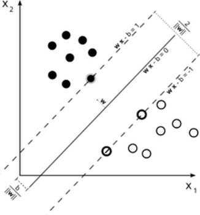

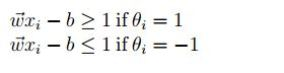

where $\|{\vec {w}}\|$ is normal vector to the hyperplane, $\theta_i$ denotes classes and $x_i$ denotes features. The distance between two hyperplanes is ${\tfrac {2}{\|{\vec {w}}\|}}$, to maximize this distance denominator value should be minimized i.e, $\|{\vec {w}}\|$ should be minimized.

For proper classification, we can build a combined equation:
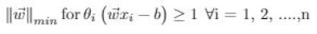

**Non-Linearly Separable**: To build classifier for non-linear data, we try to minimize
${\displaystyle \left[{\frac {1}{n}}\sum _{i=1}^{n}\max \left(0,1-y_{i}({\vec {w}}\cdot {\vec {x}}_{i}-b)\right)\right]+\lambda \lVert {\vec {w}}\rVert ^{2}}$

Here, $max()$ method will be $zero(0)$, if $x_i$ is on the correct side of the margin. For data that is on opposite side of the margin, the function’s value is proportional to the distance from the margin. Where, $\lambda$ determines tradeoff $b/w$ increasing the margin size and that ${\vec {x}}_{i}$ is on correct side of the margin.

### 1.7 Advantages of SVM Classifier:
- SVMs are effective when the number of features is quite large.
- It works effectively even if the number of features are greater than the number of samples.
- Non-Linear data can also be classified using customized hyperplanes built by using kernel trick.
- It is a robust model to solve prediction problems since it maximizes margin.

### 1.8 Disadvantages of SVM Classifier:
- The biggest limitation of Support Vector Machine is the choice of the kernel. The wrong choice of the kernel can lead to an increase in error percentage.
- With a greater number of samples, it starts giving poor performances.
- SVMs have good generalization performance but they can be extremely slow in the test phase.
- SVMs have high algorithmic complexity and extensive memory requirements due to the use of quadratic programming.

### 1.9 Support Vector Machine Libraries / Packages:
For implementing support vector machine on a dataset, we can use libraries. There are many libraries or packages available that can help us to implement SVM smoothly. We just need to call functions with parameters according to our need.

In Python, we can use libraries like sklearn. For classification, Sklearn provides functions like SVC, NuSVC & LinearSVC.

SVC() and NuSVC() methods are almost similar but with some difference in parameters. We pass values of kernel parameter, gamma and C parameter etc. By default kernel parameter uses “rbf” as its value but we can pass values like “poly”, “linear”, “sigmoid” or callable function.

LinearSVC() is an SVC for Classification that uses only linear kernel. In LinearSVC(), we don’t pass value of kernel, since it’s specifically for linear classification.

### 1.10 SVM Applications:
SVMS are a byproduct of Neural Network. They are widely applied to pattern classification and regression problems. Here are some of its applications:
- Facial expression classification: SVMs can be used to classify facial expressions. It uses statistical models of shape and SVMs.
- Speech recognition: SVMs are used to accept keywords and reject non-keywords them and build a model to recognize speech.
- Handwritten digit recognition: Support vector classifiers can be applied to the recognition of isolated handwritten digits optically scanned.
- Text Categorization: In information retrieval and then categorization of data using labels can be done by SVM.


## 2. Implementation
Support vector machine classifier is one of the most popular machine learning classification algorithm. Svm classifier mostly used in addressing multi-classification problems. If you are not aware of the multi-classification problem below are examples of multi-classification problems.

**Multi-Classification Problem Examples**:
- Given fruit features like color, size, taste, weight, shape. Predicting the fruit type.
- By analyzing the skin, predicting the different skin disease.
- Given Google news articles, predicting the topic of the article. This could be sport, movie, tech news related article, etc.

In short: Multi-classification problem means having more that 2 target classes to predict.

In the first example of predicting the fruit type. The target class will have many fruits like apple, mango, orange, banana, etc. This is same with the other two examples in predicting. The problem of the new article, the target class having different topics like sport, movie, tech news ..etc

In this article, we were going to implement the svm classifier with different kernels. However, we have explained the key aspect of support vector machine algorithm. 

To implement svm classifier in Python, we are going to use the one of most popular classification dataset which is Iris dataset.  Let’s quickly look at the features and the target variable details of the famous classification dataset.

### 2.1 Iris Dataset description
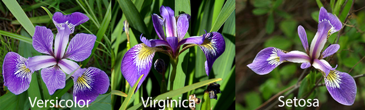

This famous classification dataset first time used in Fisher’s classic 1936 paper, The Use of Multiple Measurements in Taxonomic Problems. Iris dataset is having 4 features of iris flower and one target class.

**The 4 features are**
1. SepalLengthCm
2. SepalWidthCm
3. PetalLengthCm
4. PetalWidthCm

**The target class**
The flower species type is the target class and it having 3 types
1. Setosa
2. Versicolor
3. Virginica

The idea of implementing svm classifier in Python is to use the iris features to train an svm classifier and use the trained svm model to predict the Iris species type. To begin with let’s try to load the Iris dataset. We are going to use the iris data from Scikit-Learn package.

### 2.2 Analyzing Iris dataset
To successfully run the below scripts in your machine you need to install the required packages. It’s better to please go through the python machine learning packages installation or machine learning packages step up before running the below scripts.

**Importing Iris dataset from Scikit-Learn**
Let’s first import the required python packages
```python
# Required Packages
from sklearn import datasets
from sklearn import svm
import numpy as np
import matplotlib.pyplot as plt
```

Now let’s import the iris dataset
```python
# import iris data to model Svm classifier
iris_dataset = datasets.load_iris()
```

Using the DESCR key over the iris_dataset, we can get description of the dataset
```python
print "Iris data set Description :: ", iris_dataset['DESCR']
```

Output
```shell
Iris data set Description ::  Iris Plants Database

Notes
-----
Data Set Characteristics:
    :Number of Instances: 150 (50 in each of three classes)
    :Number of Attributes: 4 numeric, predictive attributes and the class
    :Attribute Information:
        - sepal length in cm
        - sepal width in cm
        - petal length in cm
        - petal width in cm
        - class:
                - Iris-Setosa
                - Iris-Versicolour
                - Iris-Virginica
    :Summary Statistics:

    ============== ==== ==== ======= ===== ====================
                    Min  Max   Mean    SD   Class Correlation
    ============== ==== ==== ======= ===== ====================
    sepal length:   4.3  7.9   5.84   0.83    0.7826
    sepal width:    2.0  4.4   3.05   0.43   -0.4194
    petal length:   1.0  6.9   3.76   1.76    0.9490  (high!)
    petal width:    0.1  2.5   1.20  0.76     0.9565  (high!)
    ============== ==== ==== ======= ===== ====================

    :Missing Attribute Values: None
    :Class Distribution: 33.3% for each of 3 classes.
    :Creator: R.A. Fisher
    :Donor: Michael Marshall (MARSHALL%PLU@io.arc.nasa.gov)
    :Date: July, 1988

This is a copy of UCI ML iris datasets.
http://archive.ics.uci.edu/ml/datasets/Iris

The famous Iris database, first used by Sir R.A Fisher
...
```

Now let’s get the iris features and the target classes
```python
print "Iris feature data :: ", iris_dataset['data']
```

**Output**
```shell
Iris feature data ::  [[ 5.1  3.5  1.4  0.2]
 [ 4.9  3.   1.4  0.2]
 [ 4.7  3.2  1.3  0.2]
 ...
 [ 5.   3.6  1.4  0.2]
 [ 5.4  3.9  1.7  0.4]
 [ 6.2  3.4  5.4  2.3]
 [ 5.9  3.   5.1  1.8]]
```

As we are said, these are 4 features first 2 were sepal length, sepal width and the next 2 were petal length and width. Now let’s check the target data
```python
print "Iris target :: ", iris_dataset['target']
```

**Output**
```shell
Iris target ::  [0 0 0 0 0 0 0 0 0 0 0 0 0 0 0 0 0 0 0 0 0 0 0 0 0 0 0 0 0 0 0 0 0 0 0 0 0 0 0 0 0 0 0 0 0 0 0 0 0 0 1 1 1 1 1 1 1 1 1 1 1 1 1 1 1 1 1 1 1 1 1 1 1 1 1 1 1 1 1 1 1 1 1 1 1 1 1 1 1 1 1 1 1 1 1 1 1 1 1 1 2 2 2 2 2 2 2 2 2 2 2 2 2 2 2 2 2 2 2 2 2 2 2 2 2 2 2 2 2 2 2 2 2 2 2 2 2 2 2 2 2 2 2 2 2 2 2 2 2 2]
```

### 2.3 Visualizing the Iris dataset
Let’s take the individual features like sepal, petal length, and weight and let’s visualize the corresponding target classes with different colors.

**Visualizing the relationship between sepal and target classes**
```python
def visuvalize_sepal_data():
	iris = datasets.load_iris()
	X = iris.data[:, :2]  # we only take the first two features.
	y = iris.target
	plt.scatter(X[:, 0], X[:, 1], c=y, cmap=plt.cm.coolwarm)
	plt.xlabel('Sepal length')
	plt.ylabel('Sepal width')
	plt.title('Sepal Width & Length')
	plt.show()

visuvalize_sepal_data()
```

To visualize the Sepal length, width and corresponding target classes we can create a function with name visuvalize_sepal_data. At the beginning, we are loading the iris dataset to iris variable. Next, we are storing the first 2 features in iris dataset which are sepal length and sepal width to variable x. Then we are storing the corresponding target values in variable y.

As we have seen target variable contains values like 0, 1,2 each value represents the iris flower species type. Then we are plotting the points on XY axis on X-axis we are plotting Sepal Length values. On Y-axis we are plotting Sepal Width values. If you follow installing instruction correctly on Installing Python machine learning packages and run the above code, you will get the below image.

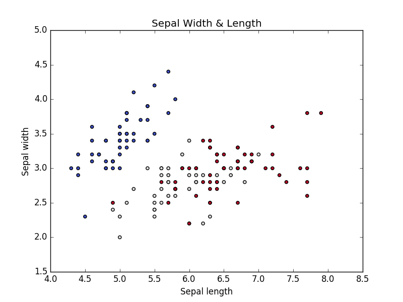

Let’s create the similar kind of graph for Petal length and width

**Visualizing the relationship between Petal and target classes**
```python
def visuvalize_petal_data():
	iris = datasets.load_iris()
	X = iris.data[:, 2:]  # we only take the last two features.
	y = iris.target
	plt.scatter(X[:, 0], X[:, 1], c=y, cmap=plt.cm.coolwarm)
	plt.xlabel('Petal length')
	plt.ylabel('Petal width')
	plt.title('Petal Width & Length')
	plt.show()

visuvalize_petal_data()
```

If we run the above code, we will get the below graph.

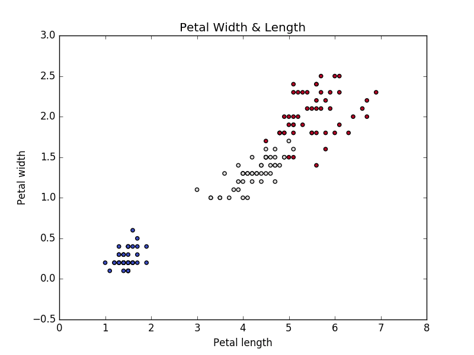

As we have successfully visualized the behavior of target class (iris species type) with respect to Sepal length and width as well as with respect to Petal length and width. Now let’s model different kernel Svm classifier by considering only the Sepal features (Length and Width) and only the Petal features (Lenght and Width)

### 2.4 Modeling Different Kernel Svm classifier using Iris Sepal features
```python
iris = datasets.load_iris()
X = iris.data[:, :2]  # we only take the Sepal two features.
y = iris.target
C = 1.0  # SVM regularization parameter

# SVC with linear kernel
svc = svm.SVC(kernel='linear', C=C).fit(X, y)
# LinearSVC (linear kernel)
lin_svc = svm.LinearSVC(C=C).fit(X, y)
# SVC with RBF kernel
rbf_svc = svm.SVC(kernel='rbf', gamma=0.7, C=C).fit(X, y)
# SVC with polynomial (degree 3) kernel
poly_svc = svm.SVC(kernel='poly', degree=3, C=C).fit(X, y)
```

To model different kernel svm classifier using the iris Sepal features, first, we loaded the iris dataset into iris variable like as we have done before. Next, we are loading the sepal length and width values into X variable, and the target values are stored in y variable. Once we are ready with data to model the svm classifier, we are just calling the scikit-learn svm module function with different kernels.

Now let’s visualize the each kernel svm classifier to understand how well the classifier fit the train features.

### 2.5 Visualizing the modeled svm classifiers with Iris Sepal features
```python
h = .02  # step size in the mesh

# create a mesh to plot in
x_min, x_max = X[:, 0].min() - 1, X[:, 0].max() + 1
y_min, y_max = X[:, 1].min() - 1, X[:, 1].max() + 1
xx, yy = np.meshgrid(np.arange(x_min, x_max, h), np.arange(y_min, y_max, h))
# title for the plots
titles = ['SVC with linear kernel',
	   'LinearSVC (linear kernel)',
	    'SVC with RBF kernel',
	    'SVC with polynomial (degree 3) kernel']

for i, clf in enumerate((svc, lin_svc, rbf_svc, poly_svc)):
	 # Plot the decision boundary. For that, we will assign a color to each
	 # point in the mesh [x_min, x_max]x[y_min, y_max].
	 plt.subplot(2, 2, i + 1)
	 plt.subplots_adjust(wspace=0.4, hspace=0.4)

	 Z = clf.predict(np.c_[xx.ravel(), yy.ravel()])

	 # Put the result into a color plot
	 Z = Z.reshape(xx.shape)
	 plt.contourf(xx, yy, Z, cmap=plt.cm.coolwarm, alpha=0.8)

	 # Plot also the training points
	 plt.scatter(X[:, 0], X[:, 1], c=y, cmap=plt.cm.coolwarm)
	 plt.xlabel('Sepal length')
	 plt.ylabel('Sepal width')
	 plt.xlim(xx.min(), xx.max())
	 plt.ylim(yy.min(), yy.max())
	 plt.xticks(())
	 plt.yticks(())
	 plt.title(titles[i])

plt.show()
```

If we run the above code, we will get the below graph. From which we can understand how well different kernel svm classifiers are modeled.

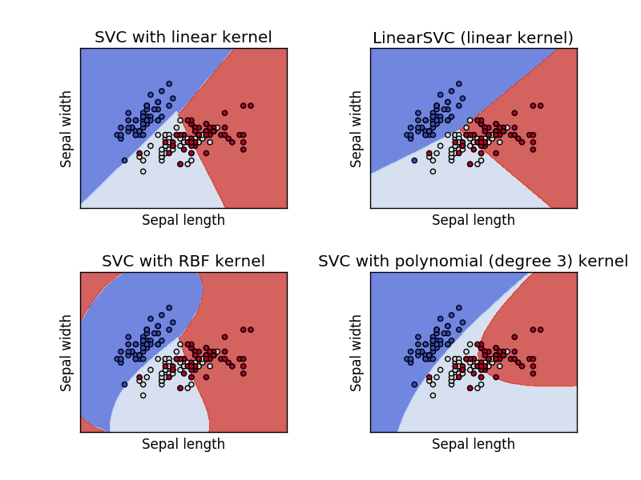

From the above graphs, you can clearly understand how different kernel modeled with the same svm classifier. Now let’s model the svm classifier with Petal features using the same kernel we have used for modeling with Sepal features.

### 2.6 Modeling Different Kernel Svm classifier using Iris Petal features
```python
iris = datasets.load_iris()
X = iris.data[:, 2:]  # we only take the last two features.
y = iris.target
C = 1.0  # SVM regularization parameter

# SVC with linear kernel
svc = svm.SVC(kernel='linear', C=C).fit(X, y)
# LinearSVC (linear kernel)
lin_svc = svm.LinearSVC(C=C).fit(X, y)
# SVC with RBF kernel
rbf_svc = svm.SVC(kernel='rbf', gamma=0.7, C=C).fit(X, y)
# SVC with polynomial (degree 3) kernel
poly_svc = svm.SVC(kernel='poly', degree=3, C=C).fit(X, y)
```

The above code is much similar to the previously modeled svm classifiers code. The only difference is loading the Petal features into X variable. The remaining code is just the copy past from the previously modeled svm classifier code.

Now let’s visualize the each kernel svm classifier to understand how well the classifier fit the Petal features.

### 2.7 Visualizing the modeled svm classifiers with Iris Petal features
```python
h = .02  # step size in the mesh
# create a mesh to plot in
x_min, x_max = X[:, 0].min() - 1, X[:, 0].max() + 1
y_min, y_max = X[:, 1].min() - 1, X[:, 1].max() + 1
xx, yy = np.meshgrid(np.arange(x_min, x_max, h), np.arange(y_min, y_max, h))

# title for the plots
titles = ['SVC with linear kernel',
	  'LinearSVC (linear kernel)',
	  'SVC with RBF kernel',
	  'SVC with polynomial (degree 3) kernel']

for i, clf in enumerate((svc, lin_svc, rbf_svc, poly_svc)):
    # Plot the decision boundary. For that, we will assign a color to each
    # point in the mesh [x_min, x_max]x[y_min, y_max].
    plt.subplot(2, 2, i + 1)
    plt.subplots_adjust(wspace=0.4, hspace=0.4)

    Z = clf.predict(np.c_[xx.ravel(), yy.ravel()])

    # Put the result into a color plot
    Z = Z.reshape(xx.shape)
    plt.contourf(xx, yy, Z, cmap=plt.cm.coolwarm, alpha=0.8)

    # Plot also the training points
    plt.scatter(X[:, 0], X[:, 1], c=y, cmap=plt.cm.coolwarm)
    plt.xlabel('Petal length')
    plt.ylabel('Petal width')
    plt.xlim(xx.min(), xx.max())
    plt.ylim(yy.min(), yy.max())
    plt.xticks(())
    plt.yticks(())
    plt.title(titles[i])

plt.show()
```

If we run the above code, we will get the below graph. From which we can understand how well different kernel svm classifiers are modeled.

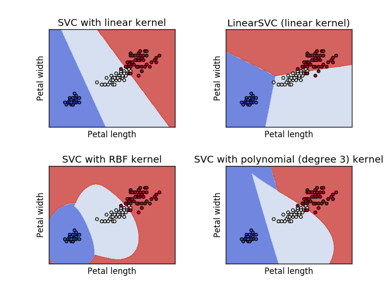

This is how the modeled svm classifier looks like when we only use the petal width and length to model. With this, we came to an end. Before put an end to the post lets quickly look how to use the modeled svm classifier to predict iris flow categories.

### 2.8 Predicting iris flower category
To Identify the iris flow type using the modeled svm classifier, we need to call the predict function over the fitted model. For example, if you want to predict the iris flower category using the lin_svc model. We need to call lin_svc.predict(with the features). In our case, these features will include the sepal length and width or petal length and width. If you are not clear with the using the predict function correctly you check [knn classifier with scikit-learn](https://dataaspirant.com/2016/12/30/k-nearest-neighbor-implementation-scikit-learn/).

### 2.9 Conclusion
In this article, we learned how to model the support vector machine classifier using different, kernel with Python scikit-learn package. In the process, we have learned how to visualize the data points and how to visualize the modeled svm classifier for understanding the how well the fitted modeled were fit with the training dataset.

