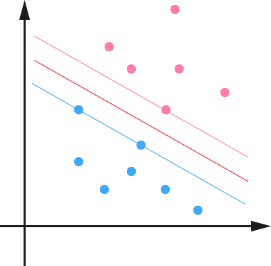
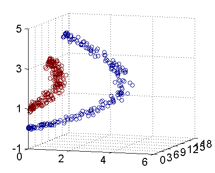

# 支持向量机

[原文](http://blog.pluskid.org/?p=632)

## 1. Maximum Margin Classifier
本文是“支持向量机系列”的第一篇。

支持向量机即 [Support Vector Machine](http://en.wikipedia.org/wiki/Support_vector_machine)，简称SVM 。我最开始听说这头机器的名号的时候，一种神秘感就油然而生，似乎把Support这么一个具体的动作和Vector这么一个抽象的概念拼到一起，然后再做成一个Machine ，一听就很玄了！

不过后来我才知道，原来SVM它并不是一头机器，而是一种算法，或者，确切地说，是一类算法，当然，这样抠字眼的话就没完没了了，比如，我说SVM实际上是一个分类器 (Classifier) ，但是其实也是有用SVM来做回归 (Regression) 的。所以，这种字眼就先不管了，还是从分类器说起吧。

SVM一直被认为是效果最好的现成可用的分类算法之一（其实有很多人都相信，“之一”是可以去掉的）。这里“现成可用”其实是很重要的，因为一直以来学术界和工业界甚至只是学术界里做理论的和做应用的之间，都有一种“鸿沟”，有些精心设计或者很复杂的算法，在抽象出来的模型里很完美，然而在实际问题上却显得很脆弱，效果很差甚至完全无效。而SVM则正好是一个特例——在两边都混得开。

好了，由于SVM的故事本身就很长，所以废话就先只说这么多了，直接入题吧。当然，说是入贴，但是也不能一上来就是SVM，而是必须要从线性分类器开始讲。这里我们考虑的是一个两类的分类问题，数据点用$x$来表示，这是一个n维向量，而类别用$y$来表示，可以取1或者-1，分别代表两个不同的类（有些地方会选0和1，当然其实分类问题选什么都无所谓，只要是两个不同的数字即可，不过这里选择+1和-1是为了方便SVM的推导，后面就会明了了）。一个线性分类器就是要在 n 维的数据空间中找到一个超平面，其方程可以表示为
- $w^Tx+b=0$

一个超平面，在二维空间中的例子就是一条直线。我们希望的是，通过这个超平面可以把两类数据分隔开来，比如，在超平面一边的数据点所对应的$y$全是-1，而在另一边全是1。具体来说，我们令 $f(x)=w^Tx+b$ ，显然，如果$f(x)=0$，那么$x$是位于超平面上的点。我们不妨要求对于所有满足$f(x)<0$ 的点，其对应的$y = -1$，而$f(x)>0$则对应$y=1$的数据点。当然，有些时候（或者说大部分时候）数据并不是线性可分的，这个时候满足这样条件的超平面就根本不存在，不过关于如何处理这样的问题我们后面会讲，这里先从最简单的情形开始推导，就假设数据都是线性可分的，亦即这样的超平面是存在的。

如图所示，两种颜色的点分别代表两个类别，红颜色的线表示一个可行的超平面。在进行分类的时候，我们将数据点$x$代入$f(x)$中，如果得到的结果小于0，则赋予其类别-1，如果大于0则赋予类别1。如果$ f(x)=0$，则很难办了，分到哪一类都不是。事实上，对于$f(x)$的绝对值很小的情况，我们都很难处理，因为细微的变动（比如超平面稍微转一个小角度）就有可能导致结果类别的改变。理想情况下，我们希望$f(x)$的值都是很大的正数或者很小的负数，这样我们就能更加确信它是属于其中某一类别的。

从几何直观上来说，由于超平面是用于分隔两类数据的，越接近超平面的点越“难”分隔，因为如果超平面稍微转动一下，它们就有可能跑到另一边去。反之，如果是距离超平面很远的点，例如图中的右上角或者左下角的点，则很容易分辩出其类别。

实际上这两个条件是互通的，我们定义函数间隔(functional margin)为
- $\hat{\gamma}=y(w^Tx+b)=yf(x)$

注意前面乘上类别$y$之后可以保证这个间隔(margin)的非负性（因为$f(x)<0$对应于$y=−1$的那些点），而点到超平面的距离定义为几何间隔(geometrical margin)。不妨来看看二者之间的关系。如图所示，

对于一个点$x$，令其垂直投影到超平面上的对应的为$x_{0}$ ，由于$w$是垂直于超平面的一个向量（请自行验证），我们有
- $x=x_0+\gamma\frac{w}{\|w\|}$

又由于$x_0$是超平面上的点，满足$f(x_0)=0$，代入超平面的方程即可算出
- $\gamma = \frac{w^Tx+b}{\|w\|}=\frac{f(x)}{\|w\|}$

不过，这里的$\gamma$是带符号的，我们需要的只是它的绝对值，因此类似地，也乘上对应的类别$y$即可，因此实际上我们定义几何间隔为：
- $\tilde{\gamma} = y\gamma = \frac{\hat{\gamma}}{\|w\|}$

**显然，函数间隔和几何间隔相差一个$\|w\|$的缩放因子**。按照我们前面的分析，对一个数据点进行分类，当它的间隔越大的时候，分类的可置信性越大。对于一个包含n个点的数据集，我们可以很自然地定义它的间隔为所有这n个点的间隔值中最小的那个。于是，为了使得分类的可置信性高，我们希望所选择的超平面(hyper plane)能够最大化这个间隔值。 这里我们有两个间隔可以选，不过函数间隔明显是不太适合用来最大化的一个量，因为在超平面固定以后，我们可以等比例地缩放$w$的长度和$b$的值，这样可以使得$f(x)=w^Tx+b$的值任意大，亦即函数间隔$\hat{\gamma}$可以在超平面保持不变的情况下被取得任意大，而几何间隔则没有这个问题，因为除上了$\|w\|$这个分母，所以缩放$w$和$b$的时候$\tilde{\gamma}$的值是不会改变的，它只随着超平面的变动而变动，因此，这是更加合适的一个间隔。这样一来，我们的**最大间隔分类器**(maximum margin classifier)的目标函数即定义为：
- $\max \tilde{\gamma}$

当然，还需要满足一些条件，根据 margin 的定义，我们有
- $y_i(w^Tx_i+b) = \hat{\gamma}_i \geq \hat{\gamma}, \quad i=1,\ldots,n$

其中$\hat{\gamma}=\tilde{\gamma}\|w\|$，根据我们刚才的讨论，即使在超平面固定的情况下，$\hat{\gamma}$的值也可以随着$\|w\|$的变化而变化。由于我们的目标就是要确定超平面，因此可以把这个无关的变量固定下来，固定的方式有两种：一是固定$\|w\|$，当我们找到最优的$\tilde{\gamma}$时$\hat{\gamma}$也就可以随之而固定；二是反过来固定$\hat{\gamma}$，此时$\|w\|$ 也可以根据最优的$\tilde{\gamma}$得到。处于方便推导和优化的目的，我们选择第二种，令$\hat{\gamma}=1$，则我们的目标函数化为：
- $\max \frac{1}{\|w\|}, \quad s.t., y_i(w^Tx_i+b)\geq 1, i=1,\ldots,n$

通过求解这个问题，我们就可以找到一个 margin 最大的 classifier ，如下图所示，中间的红色线条是最优超平面，另外两条线到红线的距离都是等于$\tilde{\gamma}$的：

到此为止，算是完成了最大间隔分类器的介绍，通过最大化间隔，我们使得该分类器对数据进行分类时具有了最大的可置信性（实际上，根据我们说给的一个数据集的间隔的定义，准确的说，应该是“对最不 confidence 的数据具有了最大的 confidence”——虽然有点拗口）。不过，到现在似乎还没有一点点Support Vector Machine的影子。很遗憾的是，这个要等到下一次再说了，不过可以先小小地剧透一下，如上图所示，我们可以看到超平面两边的那个间隙(gap)分别对应的两条平行的线（在高维空间中也应该是两个超平面）上有一些点，显然两个超平面上都会有点存在，否则我们就可以进一步扩大间隙，也就是增大$\tilde{\gamma}$的值了。这些点呢，就叫做support vector ，嗯，先说这么多了。

> ps:  本文开头那张照片真相
> 在2009年在Pittsburgh举行的G20峰会现场外面。很多反对G20的，支持G20的都来凑热闹。我们这位同学也来了，鱼目混珠的高举Support Vector Machine的牌子。很多老美就晕了，你说你支持加强控制二氧化碳排放我懂，你支持的的这个Vector Machine是个什么东西啊？然后这个同学搞笑的目的就达到了。

## 2. Support Vector
本文是“支持向量机系列”的第二篇。

上一次介绍支持向量机，结果说到**最大间隔分类器**，到最后都没有说“支持向量”到底是什么东西。不妨回忆一下上次最后一张图：

可以看到两个支撑着中间的间隙(gap)的超平面，它们到中间的分隔超平面(separating hyper plane)的距离相等（想想看：为什么一定是相等的？），即我们所能得到的最大的几何间隔$\tilde{\gamma}$ 。而“支撑”这两个超平面的必定会有一些点，试想，如果某超平面没有碰到任意一个点的话，那么我就可以进一步地扩充中间的间隙(gap)，于是这个就不是最大的间隔了。由于在n维向量空间里一个点实际上是和以原点为起点，该点为终点的一个向量是等价的，所以这些“支撑”的点便叫做支持向量（Support Vector）。

很显然，由于这些支撑向量刚好在边界上，所以它们是满足$ y(w^Tx+b)=1$（还记得我们把函数间隔定为1了吗？），而对于所有不是支持向量的点，也就是在“阵地后方”的点，则显然有$y(w^Tx+b)>1$。事实上，当最优的超平面确定下来之后，这些后方的点就完全成了路人甲了，它们可以在自己的边界后方随便飘来飘去都不会对超平面产生任何影响。这样的特性在实际中有一个最直接的好处就在于存储和计算上的优越性，例如，如果使用100万个点求出一个最优的超平面，其中是支撑向量的有100个，那么我只需要记住这100个点的信息即可，对于后续分类也只需要利用这100个点而不是全部100万个点来做计算。（当然，通常除了kNN之类的Memory-based Learning算法，通常算法也都不会直接把所有的点记忆下来，并全部用来做后续推论中的计算。不过，如果算法使用了**核函数**进行非线性化推广的话，就会遇到这个问题了。核函数在下一次会介绍。）

当然，除了从几何直观上之外，支持向量的概念也会从其优化过程的推导中得到。其实上一次还偷偷卖了另一个关子就是虽然给出了目标函数，却没有讲怎么来求解。现在就让我们来处理这个问题。回忆一下之前得到的目标函数：
- $\max \frac{1}{\|w\|}\quad s.t., y_i(w^Tx_i+b)\geq 1, i=1,\ldots,n$

这个问题等价于（为了方便求解，我在这里加上了平方，还有一个系数，显然这两个问题是等价的，因为我们关心的并不是最优情况下目标函数的具体数值）：
- $\min \frac{1}{2}\|w\|^2\quad s.t., y_i(w^Tx_i+b)\geq 1, i=1,\ldots,n$

到这个形式以后，就可以很明显地看出来，它是一个凸优化问题，或者更具体地说，它是一个二次优化问题——目标函数是二次的，约束条件是线性的。这个问题可以用任何现成的 QP (Quadratic Programming) 的优化包进行求解。所以，我们的问题到此为止就算全部解决了，于是我睡午觉去了~ :)

啊？呃，有人说我偷懒不负责任了？好吧，嗯，其实呢，虽然这个问题确实是一个标准的 QP 问题，但是它也有它的特殊结构，通过**拉格朗日对偶性**（Lagrange Duality）变换到对偶变量（dual variable） 的优化问题之后，可以找到一种更加有效的方法来进行求解——这也是SVM盛行的一大原因，通常情况下这种方法比直接使用通用的QP优化包进行优化要高效得多。此外，在推导过程中，许多有趣的特征也会被揭露出来，包括刚才提到的支撑向量的问题。

关于**拉格朗日对偶性**（Lagrange duality）我没有办法在这里细讲了，可以参考“对偶性"一文（如果不了解对偶性和KKT，下面的内容就很难理解了。在“对偶性”一文中对这两个问题都有描述）。简单地来说，通过给每一个约束条件加上一个**拉格朗日乘数**(Lagrange multiplier)，我们可以将它们融和到目标函数里去：
- $\mathcal{L}(w,b,\alpha)=\frac{1}{2}\|w\|^2-\sum_{i=1}^n\alpha_i \left(y_i(w^Tx_i+b)-1\right)$

然后我们令
- $\theta(w) = \max_{\alpha_i\geq 0}\mathcal{L}(w,b,\alpha)$

容易验证，当某个约束条件不满足时，例如$y_i(w^Tx_i+b) < 1$，那么我们显然有$\theta(w)=\infty$（只要令$\alpha_i=\infty$即可）。而当所有约束条件都满足时，则有$\theta(w)=\frac{1}{2}\|w\|^2$，亦即我们最初要最小化的量。因此，在要求约束条件得到满足的情况下最小化$\frac{1}{2}\|w\|^2$实际上等价于直接最小化$θ(w)$（当然，这里也有约束条件，就是$\alpha_i\geq 0, i=1,\ldots,n$），因为如果约束条件没有得到满足，$θ(w)$会等于无穷大，自然不会是我们所要求的最小值。具体写出来，我们现在的目标函数变成了：
- $\min_{w,b}\;\theta(w) = \min_{w,b}\; \max_{\alpha_i\geq 0}\; \mathcal{L}(w,b,\alpha) = p^*$

这里用$p^∗$表示这个问题的最优值，这个问题和我们最初的问题是等价的。不过，现在我们来把最小和最大的位置交换一下：
- $\max_{\alpha_i\geq 0}\; \min_{w,b}\; \mathcal{L}(w,b,\alpha) = d^*$

当然，交换以后的问题不再等价于原问题，这个新问题的最优值用$d^∗$来表示。并且我们有$d^∗≤p^∗$，这在直观上也不难理解，最大值中最小的一个总也比最小值中最大的一个要大吧！总之，第二个问题的最优值$d^∗$，在这里提供了一个第一个问题的最优值$p^∗$的一个下界，在满足某些条件的情况下，这两者相等，这个时候我们就可以通过求解第二个问题来间接地求解第一个问题。具体来说，就是要满足KKT条件，这里暂且先略过不说，直接给结论：我们这里的问题是满足 KKT 条件的，因此现在我们便转化为求解第二个问题。

首先要$\mathcal{L}$让关于$w$和$b$最小化，我们分别令$\partial \mathcal{L}/\partial w$和$\partial \mathcal{L}/\partial b$等于零：
- $\frac{\partial \mathcal{L}}{\partial w}=0 \Rightarrow w=\sum_{i=1}^n \alpha_i y_i x_i$
- $\frac{\partial \mathcal{L}}{\partial b} = 0 \Rightarrow \sum_{i=1}^n \alpha_i y_i = 0$

带回$\mathcal{L}$得到：
$\mathcal{L}(w,b,\alpha) = \frac{1}{2}\sum_{i,j=1}^n\alpha_i\alpha_jy_iy_jx_i^Tx_j-\sum_{i,j=1}^n\alpha_i\alpha_jy_iy_jx_i^Tx_j – b\sum_{i=1}^n\alpha_iy_i + \sum_{i=1}^n\alpha_i$
$\quad\quad\quad\quad= \sum_{i=1}^n\alpha_i – \frac{1}{2}\sum_{i,j=1}^n\alpha_i\alpha_jy_iy_jx_i^Tx_j$

此时我们得到关于对偶变量（dual variable $\alpha$）的优化问题：
- $\max_\alpha \sum_{i=1}^n\alpha_i – \frac{1}{2}\sum_{i,j=1}^n\alpha_i\alpha_jy_iy_jx_i^Tx_j$
- $s.t.$
  - $\alpha_i\geq 0, i=1,\ldots,n​$
  - $\sum_{i=1}^n\alpha_iy_i = 0$

如前面所说，这个问题有更加高效的优化算法，不过具体方法在这里先不介绍，让我们先来看看推导过程中得到的一些有趣的形式。首先就是关于我们的超平面，对于一个数据点$x$进行分类，实际上是通过把$x$带入到$f(x)=w^Tx+b$算出结果然后根据其正负号来进行类别划分的。而前面的推导中我们得到$w=\sum_{i=1}^n \alpha_i y_i x_i$，因此
- $f(x)=\left(\sum_{i=1}^n\alpha_i y_i x_i\right)^Tx+b= \sum_{i=1}^n\alpha_i y_i \langle x_i, x\rangle + b$

这里的形式的有趣之处在于，对于新点$x$的预测，只需要计算它与训练数据点的内积即可（这里$\langle \cdot, \cdot\rangle$表示向量内积），这一点至关重要，是之后使用Kernel函数进行非线性推广的基本前提。此外，所谓支持向量（Supporting Vector）也在这里显示出来——事实上，所有非支持向量（Supporting Vector）所对应的系数 α 都是等于零的，因此对于新点的内积计算实际上只要针对少量的“支持向量”而不是所有的训练数据即可。

为什么非支持向量对应的$\alpha$等于零呢？直观上来理解的话，就是这些“后方”的点——正如我们之前分析过的一样，对超平面是没有影响的，由于分类完全有超平面决定，所以这些无关的点并不会参与分类问题的计算，因而也就不会产生任何影响了。这个结论也可由刚才的推导中得出，回忆一下我们刚才通过拉格朗日乘数得到的目标函数：
- $\max_{\alpha_i\geq 0}\;\mathcal{L}(w,b,\alpha)=\max_{\alpha_i\geq 0}\;\frac{1}{2}\|w\|^2-\sum_{i=1}^n\alpha_i \color{red}{\left(y_i(w^Tx_i+b)-1\right)}$

注意到如果$x_i$是支持向量的话，上式中红颜色的部分是等于0的（因为支持向量的函数距离等于1），而对于非支持向量来说，函数距离会大于 1 ，因此红颜色部分是大于零的，而$α_i$又是非负的，为了满足最大化，$α_i$必须等于 0 。这也就是这些非支持向量（Supporting Vector）的点的悲惨命运了。

嗯，于是呢，把所有的这些东西整合起来，得到的一个**最大间隔超平面分类器**（maximum margin hyper plane classifier）就是支持向量机（Support Vector Machine），经过直观的感觉和数学上的推导，为什么叫“支持向量”，应该也就明了了吧？当然，到目前为止，我们的 SVM 还比较弱，只能处理线性的情况，不过，在得到了对偶形式之后，通过核函数推广到非线性的情况就变成了一件非常容易的事情了。不过，具体细节，还要留到下一次再细说了。

## 3. Kernel
本文是“支持向量机系列”的第三篇。

前面我们介绍了线性情况下的支持向量机，它通过寻找一个线性的超平面来达到对数据进行分类的目的。不过，由于是线性方法，所以对非线性的数据就没有办法处理了。例如图中的两类数据，分别分布为两个圆圈的形状，不论是任何高级的分类器，只要它是线性的，就没法处理，SVM也不行。因为这样的数据本身就是线性不可分的。

对于这个数据集，我可以悄悄透露一下：我生成它的时候就是用两个半径不同的圆圈加上了少量的噪音得到的，所以，一个理想的分界应该是一个“圆圈”而不是一条线（超平面）。如果用$X1$和$X2$来表示这个二维平面的两个坐标的话，我们知道一条二次曲线（圆圈是二次曲线的一种特殊情况）的方程可以写作这样的形式：
- $a_1X_1 + a_2X_1^2 + a_3 X_2 + a_4 X_2^2 + a_5 X_1X_2 + a_6 = 0$

注意上面的形式，如果我们构造另外一个五维的空间，其中五个坐标的值分别为$Z_1=X_1, Z_2=X_1^2, Z_3=X_2, Z_4=X_2^2, Z_5=X_1X_2$，那么显然，上面的方程在新的坐标系下可以写作：
- $\sum_{i=1}^5a_iZ_i + a_6 = 0$

关于新的坐标$Z$ ，这正是一个超平面的方程！也就是说，如果我们做一个映射$\phi:\mathbb{R}^2\rightarrow\mathbb{R}^5$，将$X$按照上面的规则映射为$Z$，那么在新的空间中原来的数据将变成线性可分的，从而使用之前我们推导的线性分类算法就可以进行处理了。这正是核（Kernel）方法处理非线性问题的基本思想。

再进一步描述核函数的细节之前，不妨再来看看这个例子映射过后的直观例子。当然，我没有办法把5维空间画出来，不过由于我这里生成数据的时候就是用了特殊的情形，具体来说，我这里的超平面实际的方程是这个样子（圆心在$X2$轴上的一个正圆）：
- $a_1X_1^2 + a_2(X_2-c)^2 + a_3 = 0$

因此我只需要把它映射到$Z_1=X_1^2,Z_2=X_2^2, Z3=X_2$这样一个三维空间中即可，下图（这是一个 gif 动画）即是映射之后的结果，将坐标轴经过适当的旋转，就可以很明显地看出，数据是可以通过一个平面来分开的：

现在让我们再回到SVM的情形，假设原始的数据时非线性的，我们通过一个映射$\phi(\cdot)$将其映射到一个高维空间中，数据变得线性可分了，这个时候，我们就可以使用原来的推导来进行计算，只是所有的推导现在是在新的空间，而不是原始空间中进行。当然，推导过程也并不是可以简单地直接类比的，例如，原本我们要求超平面的法向量$w$ ，但是如果映射之后得到的新空间的维度是无穷维的（确实会出现这样的情况，比如后面会提到的 Gaussian Kernel ），要表示一个无穷维的向量描述起来就比较麻烦。于是我们不妨先忽略过这些细节，直接从最终的结论来分析，回忆一下，我们上一次得到的最终的分类函数是这样的：
- $f(x) = \sum_{i=1}^n\alpha_i y_i \langle x_i, x\rangle + b$

现在则是在映射过后的空间，即
- $f(x) = \sum_{i=1}^n\alpha_i y_i \langle \phi(x_i), \phi(x)\rangle + b$

而其中的$\alpha$也是通过求解如下对偶问题而得到的：
- $\max_\alpha \sum_{i=1}^n\alpha_i – \frac{1}{2}\sum_{i,j=1}^n\alpha_i\alpha_jy_iy_j\langle \phi(x_i),\phi(x_j)\rangle$
- $s.t.,$
  - $\alpha_i\geq 0, i=1,\ldots,n$
  - $\sum_{i=1}^n\alpha_iy_i = 0$

这样一来问题就解决了吗？似乎是的：拿到非线性数据，就找一个映射$\phi(\cdot)$，然后一股脑把原来的数据映射到新空间中，再做线性SVM即可。不过若真是这么简单，我这篇文章的标题也就白写了——说了这么多，其实还没到正题呐！其实刚才的方法稍想一下就会发现有问题：在最初的例子里，我们对一个二维空间做映射，选择的新空间是原始空间的所有一阶和二阶的组合，得到了五个维度；如果原始空间是三维，那么我们会得到 19 维的新空间（验算一下？），这个数目是呈爆炸性增长的，这给$\phi(\cdot)$的计算带来了非常大的困难，而且如果遇到无穷维的情况，就根本无从计算了。所以就需要核函数出马了。

不妨还是从最开始的简单例子出发，设两个向量$x_1 = (\eta_1,\eta_2)^T$和$x_2=(\xi_1,\xi_2)^T$，而$\phi(\cdot)$即是到前面说的五维空间的映射，因此映射过后的内积为：
- $\phi(x_1) = (\eta_1, \eta_1^2, \eta_2, \eta_2^2, \eta_1\eta_2)$
- $\phi(x_2) = (\xi_1, \xi_1^2, \xi_2, \xi_2^2, \xi_1\xi_2)$
- $\langle \phi(x_1),\phi(x_2)\rangle = \eta_1\xi_1 + \eta_1^2\xi_1^2 + \eta_2\xi_2 + \eta_2^2\xi_2^2+\eta_1\eta_2\xi_1\xi_2$

另外，我们又注意到：
- $\left(\langle x_1, x_2\rangle + 1\right)^2 = ((\eta_1\xi_i+\eta_2\xi_2)+1)^2 = 2\eta_1\xi_1 + \eta_1^2\xi_1^2 + 2\eta_2\xi_2 + \eta_2^2\xi_2^2 + 2\eta_1\eta_2\xi_1\xi_2 + 1$

二者有很多相似的地方，实际上，我们只要把某几个维度线性缩放一下，然后再加上一个常数维度，具体来说，上面这个式子的计算结果实际上和映射
- $\varphi(X_1,X_2)=(\sqrt{2}X_1,X_1^2,\sqrt{2}X_2,X_2^2,\sqrt{2}X_1X_2,1)^T$

之后的内积$\langle \varphi(x_1),\varphi(x_2)\rangle$的结果是相等的（自己验算一下）。**区别在于什么地方呢？一个是映射到高维空间中，然后再根据内积的公式进行计算；而另一个则直接在原来的低维空间中进行计算，而不需要显式地写出映射后的结果。回忆刚才提到的映射的维度爆炸，在前一种方法已经无法计算的情况下，后一种方法却依旧能从容处理，甚至是无穷维度的情况也没有问题**。

我们把这里的计算两个向量在映射过后的空间中的内积的函数叫做核函数 (Kernel Function) ，例如，在刚才的例子中，我们的核函数为：
- $\kappa(x_1,x_2)=\left(\langle x_1, x_2\rangle + 1\right)^2$

核函数能简化映射空间中的内积运算——刚好“碰巧”的是，在我们的SVM里需要计算的地方数据向量总是以内积的形式出现的。对比刚才我们写出来的式子，现在我们的分类函数为：
- $\sum_{i=1}^n\alpha_i y_i \color{red}{\kappa(x_i,x)} + b$

其中$\alpha$由如下对偶问题计算而得：
- $\max_\alpha \sum_{i=1}^n\alpha_i – \frac{1}{2}\sum_{i,j=1}^n\alpha_i\alpha_jy_iy_j \color{red}{\kappa(x_i, x_j)}$
- $s.t., $
  - $\alpha_i\geq 0, i=1,\ldots,n$
  - $\sum_{i=1}^n\alpha_iy_i = 0 $

这样一来计算的问题就算解决了，避开了直接在高维空间中进行计算，而结果却是等价的，实在是一件非常美妙的事情！当然，因为我们这里的例子非常简单，所以我可以手工构造出对应于$\phi(\cdot)$的核函数出来，如果对于任意一个映射，想要构造出对应的核函数就很困难了。

最理想的情况下，我们希望知道数据的具体形状和分布，从而得到一个刚好可以将数据映射成线性可分的$\phi(\cdot)$，然后通过这个$\phi(\cdot)$得出对应的$\kappa(\cdot,\cdot)$进行内积计算。然而，第二步通常是非常困难甚至完全没法做的。不过，由于第一步也是几乎无法做到，因为对于任意的数据分析其形状找到合适的映射本身就不是什么容易的事情，所以，人们通常都是“胡乱”选择映射的，所以，根本没有必要精确地找出对应于映射的那个核函数，而只需要“胡乱”选择一个核函数即可——我们知道它对应了某个映射，虽然我们不知道这个映射具体是什么。由于我们的计算只需要核函数即可，所以我们也并不关心也没有必要求出所对应的映射的具体形式。

当然，说是“胡乱”选择，其实是夸张的说法，因为并不是任意的二元函数都可以作为核函数，所以除非某些特殊的应用中可能会构造一些特殊的核（例如用于文本分析的文本核，注意其实使用了Kernel进行计算之后，其实完全可以去掉原始空间是一个向量空间的假设了，只要核函数支持，原始数据可以是任意的“对象”——比如文本字符串），通常人们会从一些常用的核函数中选择（根据问题和数据的不同，选择不同的参数，实际上就是得到了不同的核函数），例如：
- 多项式核$\kappa(x_1,x_2) = \left(\langle x_1,x_2\rangle + R\right)^d$，显然刚才我们举的例子是这里多项式核的一个特例$R=1,d=2$。虽然比较麻烦，而且没有必要，不过这个核所对应的映射实际上是可以写出来的，该空间的维度是$\binom{m+d}{d}$，其中$m$是原始空间的维度
- 高斯核$\kappa(x_1,x_2) = \exp\left(-\frac{\|x_1-x_2\|^2}{2\sigma^2}\right)$，这个核就是最开始提到过的会将原始空间映射为无穷维空间的那个家伙。不过，如果$\sigma$选得很大的话，高次特征上的权重实际上衰减得非常快，所以实际上（数值上近似一下）相当于一个低维的子空间；反过来，如果$\sigma$选得很小，则可以将任意的数据映射为线性可分——当然，这并不一定是好事，因为随之而来的可能是非常严重的过拟合问题。不过，总的来说，通过调控参数$\sigma$，高斯核实际上具有相当高的灵活性，也是使用最广泛的核函数之一
- 线性核$\kappa(x_1,x_2) = \langle x_1,x_2\rangle$，这实际上就是原始空间中的内积。这个核存在的主要目的是使得“映射后空间中的问题”和“映射前空间中的问题”两者在形式上统一起来了

最后，总结一下：对于非线性的情况，SVM的处理方法是选择一个核函数$\kappa(\cdot,\cdot)$，通过将数据映射到高维空间，来解决在原始空间中线性不可分的问题。由于核函数的优良品质，这样的非线性扩展在计算量上并没有比原来复杂多少，这一点是非常难得的。当然，这要归功于核方法——除了SVM之外，任何将计算表示为数据点的内积的方法，都可以使用核方法进行非线性扩展。

此外，略微提一下，也有不少工作试图自动构造专门针对特定数据的分布结构的核函数，感兴趣的同学可以参考，比如 NIPS 2003 的 Cluster Kernels for Semi-Supervised Learning 和 ICML 2005 的 Beyond the point cloud: from transductive to semi-supervised learning 等。

