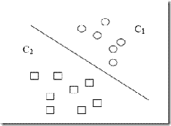
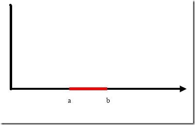
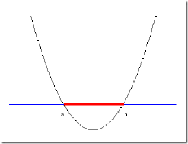
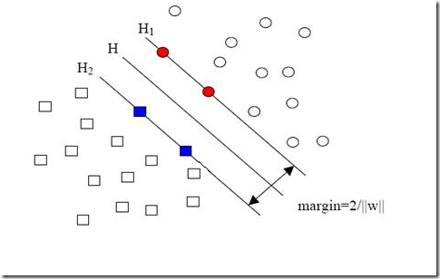
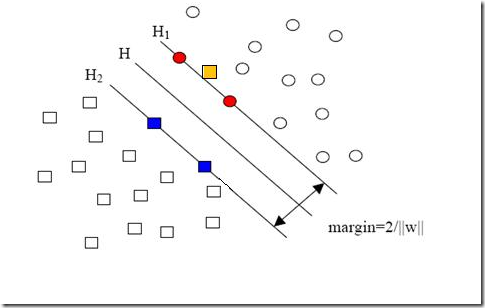
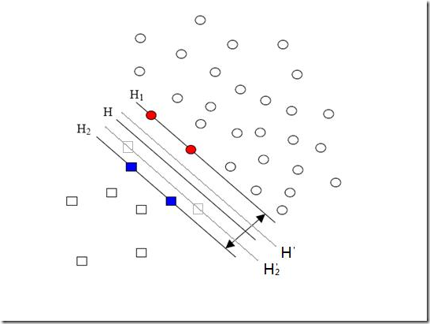
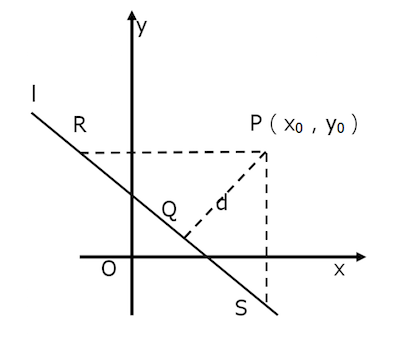

# 支持向量机(SVM)

[原文](http://www.blogjava.net/zhenandaci/archive/2009/02/13/254519.html)

## 1. 定义

支持向量机(Support Vector Machine)是Cortes和Vapnik于1995年首先提出的，它在解决小样本、非线性及高维模式识别中表现出许多特有的优势，并能够推广应用到函数拟合等其他机器学习问题中。 支持向量机方法是建立在统计学习理论的**VC维理论**和**结构风险最小原理**基础上的，根据有限的样本信息在模型的复杂性（即对特定训练样本的学习精度Accuracy）和学习能力（即无错误地识别任意样本的能力）之间寻求最佳折衷，以期获得最好的推广能力（或称泛化能力）。

Vapnik是统计机器学习的大牛，这想必都不用说，他出版的《Statistical Learning Theory》是一本完整阐述统计机器学习思想的名著。在该书中详细的论证了统计机器学习之所以区别于传统机器学习的本质，就在于统计机器学习能够精确的给出学习效果，能够解答需要的样本数等等一系列问题。与统计机器学习的精密思维相比，传统的机器学习基本上属于摸着石头过河，用传统的机器学习方法构造分类系统完全成了一种技巧，一个人做的结果可能很好，另一个人差不多的方法做出来却很差，缺乏指导和原则。

所谓VC维是对函数类的一种度量，可以简单的理解为问题的复杂程度，VC维越高，一个问题就越复杂。正是因为SVM关注的是VC维，后面我们可以看到，SVM解决问题的时候，和样本的维数是无关的（甚至样本是上万维的都可以，这使得SVM很适合用来解决文本分类的问题，当然，有这样的能力也因为引入了核函数）。

结构风险最小听上去文绉绉，其实说的也无非是下面这回事。

机器学习本质上就是一种对问题真实模型的逼近（我们选择一个我们认为比较好的近似模型，这个近似模型就叫做一个假设），但毫无疑问，真实模型一定是不知道的（如果知道了，我们干吗还要机器学习？直接用真实模型解决问题不就可以了，对吧？）既然真实模型不知道，那么我们选择的假设与问题真实解之间究竟有多大差距，我们就没法得知。比如说我们认为宇宙诞生于150亿年前的一场大爆炸，这个假设能够描述很多我们观察到的现象，但它与真实的宇宙模型之间还相差多少？谁也说不清，因为我们压根就不知道真实的宇宙模型到底是什么。

这个与问题真实解之间的误差，就叫做**风险**（更严格的说，误差的累积叫做风险）。我们选择了一个假设之后（更直观点说，我们得到了一个分类器以后），真实误差无从得知，但我们可以用某些可以掌握的量来逼近它。最直观的想法就是使用分类器在样本数据上的分类的结果与真实结果（因为样本是已经标注过的数据，是准确的数据）之间的差值来表示。这个差值叫做**经验风险Remp(w)**。以前的机器学习方法都把经验风险最小化作为努力的目标，但后来发现很多分类函数能够在样本集上轻易达到100%的正确率，在真实分类时却一塌糊涂（即所谓的推广能力差，或泛化能力差）。此时的情况便是选择了一个足够复杂的分类函数（它的VC维很高），能够精确的记住每一个样本，但对样本之外的数据一律分类错误。回头看看经验风险最小化原则我们就会发现，此原则适用的大前提是经验风险要确实能够逼近真实风险才行（行话叫一致），但实际上能逼近么？答案是不能，因为样本数相对于现实世界要分类的文本数来说简直九牛一毛，经验风险最小化原则只在这占很小比例的样本上做到没有误差，当然不能保证在更大比例的真实文本上也没有误差。

统计学习因此而引入了**泛化误差界**的概念，就是指真实风险应该由两部分内容刻画，一是**经验风险**，代表了分类器在给定样本上的误差；二是**置信风险**，代表了我们在多大程度上可以信任分类器在未知文本上分类的结果。很显然，第二部分是没有办法精确计算的，因此只能给出一个估计的区间，也使得整个误差只能计算上界，而无法计算准确的值（所以叫做泛化误差界，而不叫泛化误差）。

置信风险与两个量有关，一是样本数量，显然给定的样本数量越大，我们的学习结果越有可能正确，此时置信风险越小；二是分类函数的VC维，显然VC维越大，推广能力越差，置信风险会变大。

泛化误差界的公式为：
$R(w) \le Remp(w)+\phi(\frac{n}{h})$

公式中R(w)就是真实风险，Remp(w)就是经验风险，$\phi(\frac{n}{h})$就是置信风险。统计学习的目标从经验风险最小化变为了寻求经验风险与置信风险的和最小，即结构风险最小。

SVM正是这样一种努力最小化结构风险的算法。

SVM其他的特点就比较容易理解了：
- 小样本，并不是说样本的绝对数量少（实际上，对任何算法来说，更多的样本几乎总是能带来更好的效果），而是说与问题的复杂度比起来，SVM算法要求的样本数是相对比较少的
- 非线性，是指SVM擅长应付样本数据线性不可分的情况，主要通过松弛变量（也有人叫惩罚变量）和核函数技术来实现，这一部分是SVM的精髓，以后会详细讨论。多说一句，关于文本分类这个问题究竟是不是线性可分的，尚没有定论，因此不能简单的认为它是线性可分的而作简化处理，在水落石出之前，只好先当它是线性不可分的（反正线性可分也不过是线性不可分的一种特例而已，我们向来不怕方法过于通用）
- 高维模式识别是指样本维数很高，例如文本的向量表示，如果没有经过另一系列文章（《文本分类入门》）中提到过的降维处理，出现几万维的情况很正常，其他算法基本就没有能力应付了，SVM却可以，主要是因为SVM 产生的分类器很简洁，用到的样本信息很少（仅仅用到那些称之为“支持向量”的样本，此为后话），使得即使样本维数很高，也不会给存储和计算带来大麻烦（相对照而言，kNN算法在分类时就要用到所有样本，样本数巨大，每个样本维数再一高，这日子就没法过了……）。

下一节开始正式讨论SVM。

## 2. 线性分类器 Part1
线性分类器（一定意义上，也可以叫做感知机） 是最简单也很有效的分类器形式。在一个线性分类器中，可以看到SVM形成的思路，并接触很多SVM的核心概念。

用一个二维空间里仅有两类样本的分类问题来举个小例子。如图所示

C1和C2是要区分的两个类别，在二维平面中它们的样本如上图所示。中间的直线就是一个分类函数，它可以将两类样本完全分开。一般的，如果一个线性函数能够将样本完全正确的分开，就称这些数据是**线性可分**的，否则称为**非线性可分**的。

什么叫线性函数呢？在一维空间里就是一个点，在二维空间里就是一条直线，三维空间里就是一个平面，可以如此想象下去，如果不关注空间的维数，这种线性函数还有一个统一的名称——**超平面（Hyper Plane）**！

实际上，一个线性函数是一个**实值函数**（即函数的值是连续的实数），而我们的分类问题（例如这里的二元分类问题——回答一个样本属于还是不属于一个类别的问题）需要离散的输出值，例如用1表示某个样本属于类别C1，而用0表示不属于（不属于C1也就意味着属于C2），这时候只需要简单的在实值函数的基础上附加一个阈值即可，通过分类函数执行时得到的值大于还是小于这个阈值来确定类别归属。 

例如我们有一个线性函数
$g(x)=wx+b$

我们可以取阈值为0，这样当有一个样本x~i~需要判别的时候，我们就看$g(x_{i})$的值。若$g(x_{i})>0$，就判别为类别C1，若$g(x_{i})<0$，则判别为类别C2（等于的时候我们就拒绝判断，呵呵）。此时也等价于给函数$g(x)$附加一个符号函数$sgn()$，即$f(x)=sgn [g(x)]$是我们真正的判别函数。

关于$g(x)=wx+b$这个表达式要注意三点：
1. 式中的x不是二维坐标系中的横轴，而是样本的向量表示，例如一个样本点的坐标是(3, 8)，则x^T^=(3,8) ，而不是x=3（一般说向量都是说列向量，因此以行向量形式来表示时，就加上转置）
2. 这个形式并不局限于二维的情况，在n维空间中仍然可以使用这个表达式，只是式中的w成为了n维向量（在二维的这个例子中，w是二维向量，为了表示起来方便简洁，以下均不区别列向量和它的转置，聪明的读者一看便知）
3. g(x)不是中间那条直线的表达式，中间那条直线的表达式是g(x)=0，即wx+b=0，我们也把这个函数叫做**分类面**

实际上很容易看出来，中间那条分界线并不是唯一的，我们把它稍微旋转一下，只要不把两类数据分错，仍然可以达到上面说的效果，稍微平移一下，也可以。此时就牵涉到一个问题，对同一个问题存在多个分类函数的时候，哪一个函数更好呢？显然必须要先找一个指标来量化“好”的程度，通常使用的都是叫做**“分类间隔”**的指标。下一节我们就仔细说说分类间隔，也补一补相关的数学知识。

## 3. 线性分类器 Part2
对于文本分类这样的不适定问题（有一个以上解的问题称为不适定问题），需要有一个指标来衡量解决方案（即我们通过训练建立的分类模型）的好坏，而分类间隔是一个比较好的指标。

在进行文本分类的时候，我们可以让计算机这样来看待我们提供给它的训练样本，每一个样本由一个向量（就是那些文本特征所组成的向量）和一个标记（标示出这个样本属于哪个类别）组成。如下：
$D_{i}=(x_{i}, y_{i})$

x~i~就是文本向量（维数很高），y~i~就是分类标记。

在二元的线性分类中，这个表示分类的标记只有两个值，1和-1（用来表示属于还是不属于这个类）。有了这种表示法，我们就可以定义一个样本点到某个超平面的间隔：
$\delta_{i}=y_{i}(wx_{i}+b)$

这个公式乍一看没什么神秘的，也说不出什么道理，只是个定义而已，但我们做做变换，就能看出一些有意思的东西。

首先注意到如果某个样本属于该类别的话，那么wx~i~+b>0（记得么？这是因为我们所选的g(x)=wx+b就通过大于0还是小于0来判断分类），而y~i~也大于0；若不属于该类别的话，那么wxi+b<0，而yi也小于0，这意味着y~i~(wx~i~+b)总是大于0的，而且它的值就等于|wx~i~+b|（也就是|g(x~i~)|）!

现在把w和b进行一下归一化，即用$\frac{w}{\|w\|}$和$\frac{b}{\|w\|}$分别代替原来的w和b，那么间隔就可以写成：
$\delta_{i}=\frac{1}{\|w\|}|g(x_{i})|$

这个公式是不是看上去有点眼熟？没错，这不就是解析几何中点x~i~到直线g(x)=0的距离公式嘛！（推广一下，是到超平面g(x)=0的距离， g(x)=0就是上节中提到的分类超平面，参考[SVM相关数学知识]）

> **Tips**
> $\|w\|$是什么符号？$\|w\|$叫做向量w的范数，范数是对向量长度的一种度量。我们常说的向量长度其实指的是它的2-范数，范数最一般的表示形式为p-范数，可以写成如下表达式：
> 向量w=(w~1~, w~2~, w~3~, …… w~n~)
>
> 它的p-范数为:
> $\|w\|_{p} = \sqrt[p]{w^p_{1}+w^p_{2}+…+w^p_{n}}$

看看把p换成2的时候，不就是传统的向量长度么？当我们不指明p的时候，就像$\|w\|$这样使用时，就意味着我们不关心p的值，用几范数都可以；或者上文已经提到了p的值，为了叙述方便不再重复指明。 

当用归一化的w和b代替原值之后的间隔有一个专门的名称，叫做**几何间隔**。几何间隔所表示的正是点到超平面的欧氏距离，我们下面就简称几何间隔为“距离”。以上是单个点到某个超平面的距离（就是间隔，后面不再区别这两个词）定义，同样可以定义**一个点的集合（就是一组样本）到某个超平面的距离为此集合中离超平面最近的点的距离**。下面这张图更加直观的展示出了几何间隔的现实含义：

H是分类面，而H~1~和H~2~是平行于H，且过离H最近的两类样本的直线，H~1~与H，H~2~与H之间的距离就是几何间隔。

之所以如此关心几何间隔这个东西，是因为几何间隔与样本的误分次数间存在关系：
$误差次数 \le \lgroup \frac{2R}{\delta} \rgroup^2$。

其中的δ是样本集合到分类面的间隔，$R=max \|x_{i}\|,   i=1,...,n$，即R是所有样本中（x~i~是以向量表示的第i个样本）向量长度最长的值（也就是说代表样本的分布有多么广）。先不必追究误分次数的具体定义和推导过程，只要记得这个误分次数一定程度上代表分类器的误差。而从上式可以看出，误分次数的上界由几何间隔决定！（当然，是样本已知的时候）

至此我们就明白为何要选择几何间隔来作为评价一个解优劣的指标了，原来几何间隔越大的解，它的误差上界越小。因此最大化几何间隔成了我们训练阶段的目标，而且，与二把刀作者所写的不同，最大化分类间隔并不是SVM的专利，而是早在线性分类时期就已有的思想。

## 4. 线性分类器的求解: 问题的描述Part1
上节说到我们有了一个线性分类函数，也有了判断解优劣的标准——即有了优化的目标，这个目标就是最大化几何间隔，但是看过一些关于SVM的论文的人一定记得什么优化的目标是要最小化$\|w\|$这样的说法，这是怎么回事呢？回头再看看我们对间隔和几何间隔的定义：

间隔：$\delta = y(wx+b)=|g(x)|$

几何间隔：$\delta_{几何}=\frac{1}{\|w\|}|g(x)|$

可以看出$\delta=\|w\|\delta_{几何}$。注意到几何间隔与$\|w\|$是成反比的，因此最大化几何间隔与最小化$\|w\|$完全是一回事。而我们常用的方法并不是固定$\|w\|$的大小而寻求最大几何间隔，而是固定间隔（例如固定为1），寻找最小的$\|w\|$。

而凡是求一个函数的最小值（或最大值）的问题都可以称为寻优问题（也叫作一个规划问题），又由于找最大值的问题总可以通过加一个负号变为找最小值的问题，因此我们下面讨论的时候都针对找最小值的过程来进行。一个寻优问题最重要的部分是**目标函数**，顾名思义，就是指寻优的目标。例如我们想寻找最小的$\|w\|$这件事，就可以用下面的式子表示：
$min \|w\|^2$

但实际上对于这个目标，我们常常使用另一个完全等价的目标函数来代替，那就是：
$min \frac{1}{2}\|w\|^2$  (式1)

不难看出当$ \|w\|^2$达到最小时，$\|w\|$也达到最小，反之亦然（前提当然是$\|w\|$描述的是向量的长度，因而是非负的）。之所以采用这种形式，是因为后面的求解过程会对目标函数作一系列变换，而（式1）的形式会使变换后的形式更为简洁（添加的系数二分之一和平方，皆是为求导数所需）。

接下来我们自然会问的就是，这个式子是否就描述了我们的问题呢？（回想一下，我们的问题是有一堆点，可以被分成两类，我们要找出最好的分类面）

如果直接来解这个求最小值问题，很容易看出当$\|w\|＝0$的时候就得到了目标函数的最小值。但是你也会发现，无论你给什么样的数据，都是这个解！反映在图中，就是H1与H2两条直线间的距离无限大，这个时候，所有的样本点（无论正样本还是负样本）都跑到了H1和H2中间，而我们原本的意图是，H1右侧的被分为正类，H2 左侧的被分为负类，位于两类中间的样本则拒绝分类（拒绝分类的另一种理解是分给哪一类都有道理，因而分给哪一类也都没有道理）。这下可好，所有样本点都进入了无法分类的灰色地带。

造成这种结果的原因是在描述问题的时候只考虑了目标，而没有加入约束条件，约束条件就是在求解过程中必须满足的条件，体现在我们的问题中就是样本点必须在H1或H2的某一侧（或者至少在H1和H2上），而不能跑到两者中间。我们前文提到过把间隔固定为1，这是指把所有样本点中间隔最小的那一点的间隔定为1（这也是集合的间隔的定义，有点绕嘴），也就意味着集合中的其他点间隔都不会小于1，按照间隔的定义，满足这些条件就相当于让下面的式子总是成立：
$y_{i}[w \centerdot x_{i}+b]\ge1$，(i = 1, 2, 3, 4, …, l) (l是总的样本数)

但我们常常习惯让式子的值和0比较，因而经常用变换过的形式：
$y_{i}[w\centerdot x_{i}+b]-1\ge0$，(i = 1, 2, 3, 4, …, l) (l是总的样本数)

因此我们的两类分类问题也被我们转化成了它的数学形式，一个带约束的最小值的问题：
- $min \frac{1}{2}\|w\|^2$
- st. $y_{i}[w\centerdot x_{i}+b]-1\ge0$，(i = 1, 2, 3, 4, …, l) (l是总的样本数)

下一节我们从最一般的意义上看看一个求最小值的问题有何特征，以及如何来解。

## 5.线性分类器的求解——问题的描述Part2
从最一般的定义上说，一个求最小值的问题就是一个优化问题（也叫寻优问题，更文绉绉的叫法是规划——Programming），它同样由两部分组成，目标函数和约束条件，可以用下面的式子表示：
**min:**
$f(x)$

**subject to:** 
$c_{i}(x)\le0, i = 1,2,3,...,p$
$c_{j}(x)=0, i = p+1,p+2,p+3,...,p+q$   (式1)

约束条件用函数c来表示，就是constrain的意思啦。你可以看出一共有p+q个约束条件，其中p个是不等式约束，q个等式约束。

关于这个式子可以这样来理解：式中的x是自变量，但不限定它的维数必须为1（视乎你解决的问题空间维数，对我们的文本分类来说，那可是成千上万啊）。要求f(x)在哪一点上取得最小值（反倒不太关心这个最小值到底是多少，关键是哪一点），但不是在整个空间里找，而是在约束条件所划定的一个有限的空间里找，这个有限的空间就是优化理论里所说的可行域。注意可行域中的每一个点都要求满足所有p+q个条件，而不是满足其中一条或几条就可以（切记，要满足每个约束），同时可行域边界上的点有一个额外好的特性，它们可以使不等式约束取得等号，而边界内的点不行。

关于可行域还有个概念不得不提，那就是凸集，凸集是指有这么一个点的集合，其中任取两个点连一条直线，这条线上的点仍然在这个集合内部，因此说“凸”是很形象的（一个反例是，二维平面上，一个月牙形的区域就不是凸集，你随便就可以找到两个点违反了刚才的规定）。

回头再来看我们线性分类器问题的描述，可以看出更多的东西：
- $min \frac{1}{2}\|w\|^2$
- st. $y_{i}[w\centerdot x_{i}+b]-1\ge0$，(i = 1, 2, 3, 4, …, l) (l是总的样本数)        (式2)

在这个问题中，自变量就是w，而目标函数是w的二次函数，所有的约束条件都是w的线性函数（哎，千万不要把x~i~当成变量，它代表样本，是已知的），这种规划问题有个很有名气的称呼——**二次规划（Quadratic Programming，QP）**，而且可以更进一步的说，由于它的可行域是一个凸集，因此它是一个凸二次规划。

一下子提了这么多术语，实在不是为了让大家以后能向别人炫耀学识的渊博，这其实是我们继续下去的一个重要前提，因为在动手求一个问题的解之前（好吧，我承认，是动计算机求……），我们必须先问自己：这个问题是不是有解？如果有解，是否能找到？

对于一般意义上的规划问题，两个问题的答案都是不一定，但凸二次规划让人喜欢的地方就在于，它有解（教科书里面为了严谨，常常加限定成分，说它有全局最优解，由于我们想找的本来就是全局最优的解，所以不加也罢），而且可以找到！（当然，依据你使用的算法不同，找到这个解的速度，行话叫收敛速度，会有所不同）

对比（式2）和（式1）还可以发现，我们的线性分类器问题只有不等式约束，因此形式上看似乎比一般意义上的规划问题要简单，但解起来却并非如此。

因为我们实际上并不知道该怎么解一个带约束的优化问题。如果你仔细回忆一下高等数学的知识，会记得我们可以轻松的解一个不带任何约束的优化问题（实际上就是当年背得烂熟的函数求极值嘛，求导再找0点呗，谁不会啊？），我们甚至还会解一个只带等式约束的优化问题，也是背得烂熟的，求条件极值，记得么，通过添加拉格朗日乘子，构造拉格朗日函数，来把这个问题转化为无约束的优化问题云云（如果你一时没想通，我提醒一下，构造出的拉格朗日函数就是转化之后的问题形式，它显然没有带任何条件）。

读者问：如果只带等式约束的问题可以转化为无约束的问题而得以求解，那么可不可以把带不等式约束的问题向只带等式约束的问题转化一下而得以求解呢？

聪明，可以，实际上我们也正是这么做的。下一节就来说说如何做这个转化，一旦转化完成，求解对任何学过高等数学的人来说，都是小菜一碟啦。

## 6. 线性分类器的求解——问题的转化，直观角度
让我再一次比较完整的重复一下我们要解决的问题：我们有属于两个类别的样本点（并不限定这些点在二维空间中）若干，如图，

圆形的样本点定为正样本（连带着，我们可以把正样本所属的类叫做正类），方形的点定为负例。我们想求得这样一个线性函数（在n维空间中的线性函数）：
$g(x)=wx+b$

使得所有属于正类的点x~+~代入以后有$g(x_{+})\ge1$，而所有属于负类的点x~-~代入后有$g(x_{-})\le-1$（之所以总跟1比较，无论正一还是负一，都是因为我们固定了间隔为1，注意间隔和几何间隔的区别）。代入g(x)后的值如果在1和-1之间，我们就拒绝判断。

求这样的$g(x)$的过程就是求$w$（一个n维向量）和$b$（一个实数）两个参数的过程（但实际上只需要求$w$，求得以后找某些样本点代入就可以求得$b$）。因此在求$g(x)$的时候，$w$才是变量。

你肯定能看出来，一旦求出了$w$（也就求出了$b$），那么中间的直线H就知道了（因为它就是$wx+b=0$嘛，哈哈），那么H~1~和H~2~也就知道了（因为三者是平行的，而且相隔的距离还是$\|w\|$决定的）。那么$w$是谁决定的？显然是你给的样本决定的，一旦你在空间中给出了那些个样本点，三条直线的位置实际上就唯一确定了（因为我们求的是最优的那三条，当然是唯一的），我们解优化问题的过程也只不过是把这个确定了的东西算出来而已。

样本确定了$w$，用数学的语言描述，就是$w$可以表示为样本的某种组合：
$w=α_{1}x_{1}+α_{2}x_{2}+…+α_{n}x_{n}$

式子中的α~i~是一个一个的数（在严格的证明过程中，这些α被称为拉格朗日乘子），而x~i~是样本点，因而是向量，n就是总样本点的个数。为了方便描述，以下开始严格区别数字与向量的乘积和向量间的乘积，我会用$α_{1}x_{1}$表示数字和向量的乘积，而用$<x_{1}, x_{2}>$表示向量$x_{1}$, $x_{2}$的内积（也叫点积，注意与向量叉积的区别）。因此$g(x)$的表达式严格的形式应该是：
$g(x)=<w,x>+b$ 

但是上面的式子还不够好，你回头看看图中正样本和负样本的位置，想像一下，我不动所有点的位置，而只是把其中一个正样本点定为负样本点（也就是把一个点的形状从圆形变为方形），结果怎么样？三条直线都必须移动（因为对这三条直线的要求是必须把方形和圆形的点正确分开）！这说明w不仅跟样本点的位置有关，还跟样本的类别有关（也就是和样本的“标签”有关）。因此用下面这个式子表示才算完整： 
$w=α_{1}y_{1}x_{1}+α_{2}y_{2}x_{2}+…+α_{n}y_{n}x_{n}$ （式1） 

其中的$y_{i}$就是第i个样本的标签，它等于1或者-1。其实以上式子的那一堆拉格朗日乘子中，只有很少的一部分不等于0（不等于0才对w起决定作用），这部分不等于0的拉格朗日乘子后面所乘的样本点，其实都落在H~1~和H~2~上，也正是这部分样本（而不需要全部样本）唯一的确定了分类函数，当然，更严格的说，这些样本的一部分就可以确定，因为例如确定一条直线，只需要两个点就可以，即便有三五个都落在上面，我们也不是全都需要。这部分我们真正需要的样本点，就叫做**支持向量**！（名字还挺形象吧，他们“撑”起了分界线） 

式子也可以用求和符号简写一下：
$w=\sum_{i=1}^{n}(a_{i}y_{i}x_{i})$

因此原来的$g(x)$表达式可以写为：
$g(x)=<w, x>+b=<\sum_{i=1}^{n}(a_{i}y_{i}x_{i}), x>+b$

注意式子中$x$才是变量，也就是你要分类哪篇文档，就把该文档的向量表示代入到$x$的位置，而所有的$x_{i}$统统都是已知的样本。还注意到式子中只有$x_{i}$和$x$是向量，因此一部分可以从内积符号中拿出来，得到$g(x)$的式子为：
$g(x)=<w, x>+b=\sum_{i=1}^{n}(a_{i}y_{i}<x_{i}, x>)+b$

发现了什么？$w$不见啦！从求$w$变成了求$α$。 

但肯定有人会说，这并没有把原问题简化呀。嘿嘿，其实简化了，只不过在你看不见的地方，以这样的形式描述问题以后，我们的优化问题少了很大一部分不等式约束（记得这是我们解不了极值问题的万恶之源）。但是接下来先跳过线性分类器求解的部分，来看看 SVM在线性分类器上所做的重大改进——**核函数**。

## 7. 为什么需要核函数
	生存？还是毁灭？——哈姆雷特
	可分？还是不可分？——支持向量机

之前一直在讨论的线性分类器，器如其名（汗，这是什么说法啊），只能对线性可分的样本做处理。如果提供的样本线性不可分，结果很简单，线性分类器的求解程序会无限循环，永远也解不出来。这必然使得它的适用范围大大缩小，而它的很多优点我们实在不原意放弃，怎么办呢？是否有某种方法，让线性不可分的数据变得线性可分呢？

有！其思想说来也简单，来用一个二维平面中的分类问题作例子，你一看就会明白。事先声明，下面这个例子是网络早就有的，我一时找不到原作者的正确信息，在此借用，并加进了我自己的解说而已。

例子是下面这张图：

我们把横轴上端点a和b之间红色部分里的所有点定为正类，两边的黑色部分里的点定为负类。试问能找到一个线性函数把两类正确分开么？不能，因为二维空间里的线性函数就是指直线，显然找不到符合条件的直线。

但我们可以找到一条曲线，例如下面这一条：

显然通过点在这条曲线的上方还是下方就可以判断点所属的类别（你在横轴上随便找一点，算算这一点的函数值，会发现负类的点函数值一定比0大，而正类的一定比0小）。这条曲线就是我们熟知的二次曲线，它的函数表达式可以写为：
$g(x)=c_{0}+c_{1}x+c_{2}x^2$

问题只是它不是一个线性函数，但是，下面要注意看了，新建一个向量y和a：
$$
y=
\left[ \begin{matrix}
   y_{1} \\ y_{2} \\ y_{3}
\end{matrix} \right]
=
\left[ \begin{matrix}
   1 \\ x \\ x^2
\end{matrix} \right]
,
a=
\left[ \begin{matrix}
   a_{1} \\ a_{2} \\ a_{3}
\end{matrix} \right]
=
\left[ \begin{matrix}
   c_{0} \\ c_{1} \\ c_{2}
\end{matrix} \right]
$$

这样g(x)就可以转化为$f(y)=<a,y>$，你可以把y和a分别回带一下，看看等不等于原来的g(x)。用内积的形式写你可能看不太清楚，实际上f(y)的形式就是：
$g(x)=f(y)=ay$

在任意维度的空间中，这种形式的函数都是一个线性函数（只不过其中的a和y都是多维向量罢了），因为自变量y的次数不大于1。

看出妙在哪了么？原来在二维空间中一个线性不可分的问题，映射到四维空间后，变成了线性可分的！因此这也形成了我们最初想解决线性不可分问题的基本思路——向高维空间转化，使其变得线性可分。

而转化最关键的部分就在于找到x到y的映射方法。遗憾的是，如何找到这个映射，没有系统性的方法（也就是说，纯靠猜和凑）。具体到我们的文本分类问题，文本被表示为上千维的向量，即使维数已经如此之高，也常常是线性不可分的，还要向更高的空间转化。其中的难度可想而知。

> **小Tips: 为什么说f(y)=ay是四维空间里的函数?**
> 大家可能一时没看明白。回想一下我们二维空间里的函数定义：
> $g(x)=ax+b$，
> 变量x是一维的，为什么说它是二维空间里的函数呢？因为还有一个变量我们没写出来，它的完整形式其实是$y=g(x)=ax+b$，即$y=ax+b$。看看，现在有几个变量？两个。那是几维空间的函数？
> 再看看$f(y)=ay$里面的y是三维的变量，那f(y)是几维空间里的函数？

用一个具体文本分类的例子来看看这种向高维空间映射从而分类的方法如何运作，想象一下，我们文本分类问题的原始空间是1000维的（即每个要被分类的文档被表示为一个1000维的向量），在这个维度上问题是线性不可分的。

现在我们有一个2000维空间里的线性函数$f(x’)=<w’,x’>+b$，注意向量的右上角有个 ’哦，它能够将原问题变得可分。式中的 w’和x’都是2000维的向量，只不过w’是定值，而x’是变量（好吧,严格说来这个函数是2001维的），现在我们的输入呢，是一个1000维的向量x，分类的过程是先把x变换为2000维的向量x’，然后求这个变换后的向量x’与向量w’的内积，再把这个内积的值和b相加，就得到了结果，看结果大于阈值还是小于阈值就得到了分类结果。

你发现了什么？我们其实只关心那个高维空间里内积的值，那个值算出来了，分类结果就算出来了。而从理论上说， x’是经由x变换来的，因此广义上可以把它叫做x的函数（有一个x，就确定了一个x’，对吧，确定不出第二个），而w’是常量，它是一个低维空间里的常量w经过变换得到的，所以给了一个w 和x的值，就有一个确定的f(x’)值与其对应。这让我们幻想，是否能有这样一种函数K(w,x),他接受低维空间的输入值，却能算出高维空间的内积值<w’,x’>？

如果有这样的函数，那么当给了一个低维空间的输入x以后，则
$g(x)=K(w,x)+b$
$f(x’)=<w’,x’>+b$

这两个函数的计算结果就完全一样，我们也就用不着费力找那个映射关系，直接拿低维的输入往g(x)里面代就可以了（再次提醒，这回的g(x)就不是线性函数啦，因为你不能保证K(w,x)这个表达式里的x次数不高于1哦）。

万幸的是，这样的$K(w,x)$确实存在（发现凡是我们人类能解决的问题，大都是巧得不能再巧，特殊得不能再特殊的问题，总是恰好有些能投机取巧的地方才能解决，由此感到人类的渺小），它被称作核函数（核，kernel），而且还不止一个，事实上，只要是满足了**Mercer条件**的函数，都可以作为核函数。核函数的基本作用就是接受两个低维空间里的向量，能够计算出经过某个变换后在高维空间里的向量内积值。几个比较常用的核函数教课书里都列过，我就不敲了。

回想我们上节说的求一个线性分类器，它的形式应该是：
$f(x’)=\sum_{i=i}^{n}a_{i}y_{i}<x’_{i}, x’>+b$。

现在这个就是高维空间里的线性函数（为了区别低维和高维空间里的函数和向量，我改了函数的名字，并且给w和x都加上了 ’），我们就可以用一个低维空间里的函数（再一次的，这个低维空间里的函数就不再是线性的啦）来代替：
$g(x)=\sum_{i=1}^{n}a_{i}y_{i}K(x_{i}, x)+b$

又发现什么了？f(x’) 和g(x)里的α，y，b全都是一样一样的！这就是说，尽管给的问题是线性不可分的，但是我们就硬当它是线性问题来求解，只不过求解过程中，凡是要求内积的时候就用你选定的核函数来算。这样求出来的α再和你选定的核函数一组合，就得到分类器啦！ 

明白了以上这些，会自然的问接下来两个问题： 
1. 既然有很多的核函数，针对具体问题该怎么选择？ 
2. 如果使用核函数向高维空间映射后，问题仍然是线性不可分的，那怎么办？ 

第一个问题现在就可以回答你：对核函数的选择，现在还缺乏指导原则！各种实验的观察结果（不光是文本分类）的确表明，某些问题用某些核函数效果很好，用另一些就很差，但是一般来讲，径向基核函数是不会出太大偏差的一种，首选。（我做文本分类系统的时候，使用径向基核函数，没有参数调优的情况下，绝大部分类别的准确和召回都在85%以上，可见。虽然libSVM的作者林智仁认为文本分类用线性核函数效果更佳，待考证） 

对第二个问题的解决则引出了我们下一节的主题：松弛变量。

## 8. 松弛变量
现在我们已经把一个本来线性不可分的文本分类问题，通过映射到高维空间而变成了线性可分的。就像下图这样：

圆形和方形的点各有成千上万个（毕竟，这就是我们训练集中文档的数量嘛，当然很大了）。现在想象我们有另一个训练集，只比原先这个训练集多了一篇文章，映射到高维空间以后（当然，也使用了相同的核函数），也就多了一个样本点，但是这个样本的位置是这样的：

就是图中黄色那个点，它是方形的，因而它是负类的一个样本，这单独的一个样本，使得原本线性可分的问题变成了线性不可分的。这样类似的问题（仅有少数点线性不可分）叫做“近似线性可分”的问题。

以我们人类的常识来判断，说有一万个点都符合某种规律（因而线性可分），有一个点不符合，那这一个点是否就代表了分类规则中我们没有考虑到的方面呢（因而规则应该为它而做出修改）？

其实我们会觉得，更有可能的是，这个样本点压根就是错误，是噪声，是提供训练集的同学人工分类时一打瞌睡错放进去的。所以我们会简单的忽略这个样本点，仍然使用原来的分类器，其效果丝毫不受影响。

但这种对噪声的容错性是人的思维带来的，我们的程序可没有。由于我们原本的优化问题的表达式中，确实要考虑所有的样本点（不能忽略某一个，因为程序它怎么知道该忽略哪一个呢？），在此基础上寻找正负类之间的最大几何间隔，而几何间隔本身代表的是距离，是非负的，像上面这种有噪声的情况会使得整个问题无解。这种解法其实也叫做**硬间隔**分类法，因为他硬性的要求所有样本点都满足和分类平面间的距离必须大于某个值。

因此由上面的例子中也可以看出，硬间隔的分类法其结果容易受少数点的控制，这是很危险的（尽管有句话说真理总是掌握在少数人手中，但那不过是那一小撮人聊以自慰的词句罢了，咱还是得民主）。

但解决方法也很明显，就是仿照人的思路，允许一些点到分类平面的距离不满足原先的要求。由于不同的训练集各点的间距尺度不太一样，因此用间隔（而不是几何间隔）来衡量有利于我们表达形式的简洁。我们原先对样本点的要求是：
$y_{i}[(wx_{i})+b]\ge1$，其中，$i=(1,2,3,...,l)$，l是样本数。

意思是说离分类面最近的样本点函数间隔也要比1大。如果要引入容错性，就给1这个硬性的阈值加一个松弛变量，即允许：
$y_{i}[(wx_{i})+b]\ge1-\zeta_{i}$，其中，$i=(1,2,3,...,l), \zeta_{i}\ge0$，l是样本数。

因为松弛变量是非负的，因此最终的结果是要求间隔可以比1小。但是当某些点出现这种间隔比1小的情况时（这些点也叫**离群点**），意味着我们放弃了对这些点的精确分类，而这对我们的分类器来说是种损失。但是放弃这些点也带来了好处，那就是使分类面不必向这些点的方向移动，因而可以得到更大的几何间隔（在低维空间看来，分类边界也更平滑）。显然我们必须权衡这种损失和好处。好处很明显，我们得到的分类间隔越大，好处就越多。

回顾我们原始的硬间隔分类对应的优化问题：
$min \frac{1}{2}\|w\|^2$
st. $y_{i}[w\centerdot x_{i}+b]-1\ge0$，(i = 1, 2, 3, 4, …, l) (l是总的样本数) 

$\|w\|^2$就是我们的目标函数（当然系数可有可无），希望它越小越好，因而损失就必然是一个能使之变大的量（能使它变小就不叫损失了，我们本来就希望目标函数值越小越好）。那如何来衡量损失，有两种常用的方式，有人喜欢用$\sum_{i=1}^{l}\zeta_{i}^2$，而有人喜欢用$\sum_{i=1}^{l}\zeta_{i}$。

上述两种方法中，l都是样本的数目。两种方法没有大的区别。如果选择了第一种，得到的方法的就叫做**二阶软间隔分类器**，第二种就叫做**一阶软间隔分类器**。把损失加入到目标函数里的时候，就需要一个惩罚因子（cost，也就是libSVM的诸多参数中的C），原来的优化问题就变成了下面这样：
$min \frac{1}{2}\|w\|^2+C\sum_{i=1}^{l}\zeta_{i}$
st. $y_{i}[w\centerdot x_{i}+b]\ge1-\zeta_{i}$，$i=(1,2,3,...,l), \zeta_{i}\ge0$ (l是总的样本数) 

这个式子有这么几点要注意：
1. 并非所有的样本点都有一个松弛变量与其对应。实际上只有“离群点”才有，或者也可以这么看，所有没离群的点松弛变量都等于0（对负类来说，离群点就是在前面图中，跑到H2右侧的那些负样本点，对正类来说，就是跑到H1左侧的那些正样本点）
2. 松弛变量的值实际上标示出了对应的点到底离群有多远，值越大，点就越远
3. 惩罚因子C决定了你有多重视离群点带来的损失，显然当所有离群点的松弛变量的和一定时，你定的C越大，对目标函数的损失也越大，此时就暗示着你非常不愿意放弃这些离群点，最极端的情况是你把C定为无限大，这样只要稍有一个点离群，目标函数的值马上变成无限大，马上让问题变成无解，这就退化成了硬间隔问题
4. 惩罚因子C不是一个变量，整个优化问题在解的时候，C是一个你必须事先指定的值，指定这个值以后，解一下，得到一个分类器，然后用测试数据看看结果怎么样，如果不够好，换一个C的值，再解一次优化问题，得到另一个分类器，再看看效果，如此就是一个参数寻优的过程，但这和优化问题本身决不是一回事，优化问题在解的过程中，C一直是定值，要记住
5. 尽管加了松弛变量这么一说，但这个优化问题仍然是一个优化问题，解它的过程比起原始的硬间隔问题来说，没有任何更加特殊的地方

从大的方面说优化问题解的过程，就是先试着确定一下w，也就是确定了前面图中的三条直线，这时看看间隔有多大，又有多少点离群，把目标函数的值算一算，再换一组三条直线（你可以看到，分类的直线位置如果移动了，有些原来离群的点会变得不再离群，而有的本来不离群的点会变成离群点），再把目标函数的值算一算，如此往复（迭代），直到最终找到目标函数最小时的w。

啰嗦了这么多，读者一定可以马上自己总结出来，松弛变量也就是个解决线性不可分问题的方法罢了，但是回想一下，核函数的引入不也是为了解决线性不可分的问题么？为什么要为了一个问题使用两种方法呢？

其实两者还有微妙的不同。一般的过程应该是这样，还以文本分类为例。在原始的低维空间中，样本相当的不可分，无论你怎么找分类平面，总会有大量的离群点，此时用核函数向高维空间映射一下，虽然结果仍然是不可分的，但比原始空间里的要更加接近线性可分的状态（就是达到了近似线性可分的状态），此时再用松弛变量处理那些少数“冥顽不化”的离群点，就简单有效得多啦。

本节中的（式1）也确实是支持向量机最最常用的形式。至此一个比较完整的支持向量机框架就有了，简单说来，支持向量机就是使用了核函数的软间隔线性分类法。

下一节会说说松弛变量剩下的一点点东西。

## 9. 松弛变量(续)
接下来要说的东西其实不是松弛变量本身，但由于是为了使用松弛变量才引入的，因此放在这里也算合适，那就是惩罚因子C。回头看一眼引入了松弛变量以后的优化问题：
$min \frac{1}{2}\|w\|^2+C\sum_{i=1}^{l}\zeta_{i}$
st. $y_{i}[w\centerdot x_{i}+b]\ge1-\zeta_{i}$，$i=(1,2,3,...,l), \zeta_{i}\ge0$ (l是总的样本数) 

注意其中C的位置，也可以回想一下C所起的作用（表征你有多么重视离群点，C越大越重视，越不想丢掉它们）。这个式子是以前做SVM的人写的，大家也就这么用，但没有任何规定说必须对所有的松弛变量都使用同一个惩罚因子，我们完全可以给每一个离群点都使用不同的C，这时就意味着你对每个样本的重视程度都不一样，有些样本丢了也就丢了，错了也就错了，这些就给一个比较小的C；而有些样本很重要，决不能分类错误（比如中央下达的文件啥的，笑），就给一个很大的C。 

当然实际使用的时候并没有这么极端，但一种很常用的变形可以用来解决分类问题中样本的“偏斜”问题。 

先来说说样本的偏斜问题，也叫数据集偏斜（unbalanced），它指的是参与分类的两个类别（也可以指多个类别）样本数量差异很大。比如说正类有10，000个样本，而负类只给了100个，这会引起的问题显而易见，可以看看下面的图：

方形的点是负类。H，H~1~，H~2~是根据给的样本算出来的分类面，由于负类的样本很少很少，所以有一些本来是负类的样本点没有提供，比如图中两个灰色的方形点，如果这两个点有提供的话，那算出来的分类面应该是H’，H2’和H1，他们显然和之前的结果有出入，实际上负类给的样本点越多，就越容易出现在灰色点附近的点，我们算出的结果也就越接近于真实的分类面。但现在由于偏斜的现象存在，使得数量多的正类可以把分类面向负类的方向“推”，因而影响了结果的准确性。

对付数据集偏斜问题的方法之一就是在惩罚因子上作文章，想必大家也猜到了，那就是给样本数量少的负类更大的惩罚因子，表示我们重视这部分样本（本来数量就少，再抛弃一些，那人家负类还活不活了），因此我们的目标函数中因松弛变量而损失的部分就变成了：
$C_{+}\sum_{i=1}^{p}\zeta_{i}+C_{-}\sum_{j=p+1}^{p+q}\zeta{j}$， 其中，$\zeta_{i}\ge0$

其中i=1…p都是正样本，j=p+1…p+q都是负样本。libSVM这个算法包在解决偏斜问题的时候用的就是这种方法。 

那C~+~和C~-~怎么确定呢？它们的大小是试出来的（参数调优），但是他们的比例可以有些方法来确定。咱们先假定说C+是5这么大，那确定C-的一个很直观的方法就是使用两类样本数的比来算，对应到刚才举的例子，C-就可以定为500这么大（因为10，000：100=100：1嘛）。 

但是这样并不够好，回看刚才的图，你会发现正类之所以可以“欺负”负类，其实并不是因为负类样本少，真实的原因是负类的样本分布的不够广（没扩充到负类本应该有的区域）。说一个具体点的例子，现在想给政治类和体育类的文章做分类，政治类文章很多，而体育类只提供了几篇关于篮球的文章，这时分类会明显偏向于政治类，如果要给体育类文章增加样本，但增加的样本仍然全都是关于篮球的（也就是说，没有足球，排球，赛车，游泳等等），那结果会怎样呢？虽然体育类文章在数量上可以达到与政治类一样多，但过于集中了，结果仍会偏向于政治类！所以给C+和C-确定比例更好的方法应该是衡量他们分布的程度。比如可以算算他们在空间中占据了多大的体积，例如给负类找一个超球——就是高维空间里的球啦——它可以包含所有负类的样本，再给正类找一个，比比两个球的半径，就可以大致确定分布的情况。显然半径大的分布就比较广，就给小一点的惩罚因子。 

但是这样还不够好，因为有的类别样本确实很集中，这不是提供的样本数量多少的问题，这是类别本身的特征（就是某些话题涉及的面很窄，例如计算机类的文章就明显不如文化类的文章那么“天马行空”），这个时候即便超球的半径差异很大，也不应该赋予两个类别不同的惩罚因子。 

看到这里读者一定疯了，因为说来说去，这岂不成了一个解决不了的问题？然而事实如此，完全的方法是没有的，根据需要，选择实现简单又合用的就好（例如libSVM就直接使用样本数量的比）。

## 10. 将SVM用于多类分类
从 SVM的那几张图可以看出来，SVM是一种典型的两类分类器，即它只回答属于正类还是负类的问题。而现实中要解决的问题，往往是多类的问题（少部分例外，例如垃圾邮件过滤，就只需要确定“是”还是“不是”垃圾邮件），比如文本分类，比如数字识别。如何由两类分类器得到多类分类器，就是一个值得研究的问题。

还以文本分类为例，现成的方法有很多，其中一种一劳永逸的方法，就是真的一次性考虑所有样本，并求解一个多目标函数的优化问题，一次性得到多个分类面，就像下图这样：

多个超平面把空间划分为多个区域，每个区域对应一个类别，给一篇文章，看它落在哪个区域就知道了它的分类。

看起来很美对不对？只可惜这种算法还基本停留在纸面上，因为一次性求解的方法计算量实在太大，大到无法实用的地步。

稍稍退一步，我们就会想到所谓“一类对其余”的方法，就是每次仍然解一个两类分类的问题。比如我们有5个类别，第一次就把类别1的样本定为正样本，其余2，3，4，5的样本合起来定为负样本，这样得到一个两类分类器，它能够指出一篇文章是还是不是第1类的；第二次我们把类别2 的样本定为正样本，把1，3，4，5的样本合起来定为负样本，得到一个分类器，如此下去，我们可以得到5个这样的两类分类器（总是和类别的数目一致）。到了有文章需要分类的时候，我们就拿着这篇文章挨个分类器的问：是属于你的么？是属于你的么？哪个分类器点头说是了，文章的类别就确定了。这种方法的好处是每个优化问题的规模比较小，而且分类的时候速度很快（只需要调用5个分类器就知道了结果）。但有时也会出现两种很尴尬的情况，例如拿一篇文章问了一圈，每一个分类器都说它是属于它那一类的，或者每一个分类器都说它不是它那一类的，前者叫**分类重叠现象**，后者叫**不可分类现象**。分类重叠倒还好办，随便选一个结果都不至于太离谱，或者看看这篇文章到各个超平面的距离，哪个远就判给哪个。不可分类现象就着实难办了，只能把它分给第6个类别了……更要命的是，本来各个类别的样本数目是差不多的，但“其余”的那一类样本数总是要数倍于正类（因为它是除正类以外其他类别的样本之和嘛），这就人为的造成了上一节所说的“数据集偏斜”问题。

因此我们还得再退一步，还是解两类分类问题，还是每次选一个类的样本作正类样本，而负类样本则变成只选一个类（称为“一对一单挑”的方法，哦，不对，没有单挑，就是“一对一”的方法，呵呵），这就避免了偏斜。因此过程就是算出这样一些分类器，第一个只回答“是第1类还是第2类”，第二个只回答“是第1类还是第3类”，第三个只回答“是第1类还是第4类”，如此下去，你也可以马上得出，这样的分类器应该有5 X 4/2=10个（通式是，如果有k个类别，则总的两类分类器数目为k(k-1)/2）。虽然分类器的数目多了，但是在训练阶段（也就是算出这些分类器的分类平面时）所用的总时间却比“一类对其余”方法少很多，在真正用来分类的时候，把一篇文章扔给所有分类器，第一个分类器会投票说它是“1”或者“2”，第二个会说它是“1”或者“3”，让每一个都投上自己的一票，最后统计票数，如果类别“1”得票最多，就判这篇文章属于第1类。这种方法显然也会有分类重叠的现象，但不会有不可分类现象，因为总不可能所有类别的票数都是0。看起来够好么？其实不然，想想分类一篇文章，我们调用了多少个分类器？10个，这还是类别数为5的时候，类别数如果是1000，要调用的分类器数目会上升至约500,000个（类别数的平方量级）。这如何是好？

看来我们必须再退一步，在分类的时候下功夫，我们还是像一对一方法那样来训练，只是在对一篇文章进行分类之前，我们先按照下面图的样子来组织分类器（如你所见，这是一个有向无环图，因此这种方法也叫做DAG SVM）

## 11. SVM相关数学知识
### 11.1 点到直线的距离
在解析几何中，有很多方法推导点到直线的距离。这里我们使用面积法推算。如图所示：

设$R(x_{R}, y_{0})，S(x_{0},y_{S})$，由R，S在直线l上，得到：
- $Ax_{R}+By_{0}+C=0$
- $Ax_{0}+By_{S}+C=0$
- $x_{R} = \frac{-By_{0}-C}{A}，y_{S} = \frac{-Ax_{0}-C}{B}$，

所以：
- $|PR|=|x_{0}-x_{R}|=|\frac{Ax_{0}+By_{0}+C}{A}|$
- $|PS|=|y_{0}-y_{s}|=|\frac{Ax_0+By_0+C}{B} |$

于是有：
$|RS| = \sqrt{|PR|^2+|PS|^2} = \frac{\sqrt{A^2+B^2} }{AB} \cdot |Ax_0+By_0+C|$，

从三角形面积公式知：
$d\cdot |RS|=|PR|\cdot |PS|$，

最后得出点到直线的距离公式：
$d=\frac{|Ax_0+By_0+C|}{\sqrt{A^2+B^2} }$。

### 11.2 VC维度

### 11.3 范数

### 11.4 凸集 

### 11.5 二次规划

### 11.6 拉格朗日函数