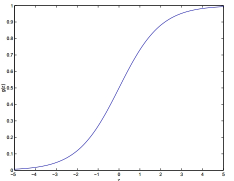
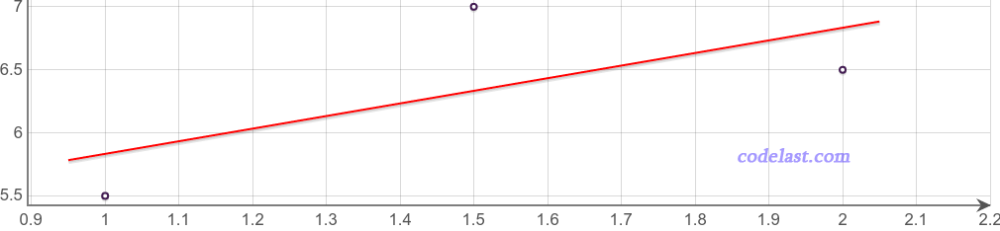

# 1. 算法原理

## 1.1  总述
逻辑回归是一种分类算法（Logistic Regression虽然名字里有`回归`，但是逻辑回归却是一种分类算法）。分类，也就是把一个群体（或问题，或数据）分为几个类别，例如，男、女、人妖；爱她的人、不爱她的人；今天会下雨、今天不会下雨，等等。

逻辑回归最常用于处理“二分类”问题，也就是说分类只有两个，像“爱她的人/不爱她的人”就是二分类，而“男/女/人妖”就不是二分类。当然，逻辑回归也可以用于处理多分类问题，即所谓的“多分类逻辑回归”（Multiclass Logistic Regression），后续我们会谈到。

简而言之，逻辑回归就是给你一条数据，用逻辑回归算法可以判断出这条数据应该被分到两个类别中的哪个中去。

逻辑回归在现实世界中非常有用。例如，可以用逻辑回归算法来判断一个用户是否会点击一个广告（会点击／不会点击）、判断两类人是否会相爱（会相爱／不会相爱），等等。

## 1.2 原理
机器学习的主旨就是通过对历史数据的计算（即“学习”），得到一些未知参数的值并建立一个分析模型，从而可以推断出新数据会有什么结论。例如一个非常简单的函数： $y=ax+b$ ，在已知几组$ (x,y)$ 历史数据的情况下：
```
(1, 5.5)
(1.5, 7)
(2, 6.5)
```

我们怎样能够预测一个未知的自变量$x=3$会对应什么样的因变量$y$呢？也就是说，$x=3$时$y=?$。 显然我们的任务就是计算出两个未知参数$a$和$b$的值，有了这两个值，那么任意给定一个$x$，我们都能通过函数$y=ax+b$计算出$y$的值了，这就是所谓的“预测”。

逻辑回归也是类似，我们有一个函数$y=f(X)$，里面包含若干个未知参数$\theta_0, \theta_1, \theta_2, ⋯, \theta_n$。由于现实世界是复杂的，因变量$y$通常会跟很多因素（即自变量$x$）有关系，即$x_0, x_1, x_2, ⋯, x_n$ ，所以这里自变量是一个向量，这里用大写的$X$来表示。同理，那一堆未知的参数也是一个向量，用一个字母$\theta$来表示。现在给我们采集并分类好的历史数据集$(x,y)$，我们要想办法计算出所有未知参数的值，然后就可以拿来预测新的$x$值所对应的$y$值了。

那么这个函数是什么？这里我们先给出答案，再解释为什么选择这个函数。$y=f(X)$中的函数$f$定义为：
- $f(X) = \frac{1}{1+e^{-\theta^TX}}$

其中，$\theta$是参数向量，$X$是自变量（向量），这个函数有个专有的名字：$Sigmoid$函数或逻辑函数。

那么，这个函数是怎么来的呢？

首先我们看$\theta^TX$这部分：这是参数向量与自变量（向量）的点积，这个式子想要表达的含义是：计算某个事件发生的可能性，可以把跟这个事件相关的所有特征加权求和。例如，要预测今天下雨的可能性，可以把今天所有和下雨相关的概率加权求和，例如梅雨季节权重为9（每天都可能下雨）、有台风经过权重为6等等，每一个因素都影响着“下雨的可能性”，即：
- $s = \sum_{i = 0}^{n}\theta _ix_i = {\theta _0}{x_0} + {\theta _1}{x_1} + \cdots + {\theta _n}{x_n} = \theta^TX$

这个加权公式求和的结果是在$(-\infty, \infty)$范围内的，为了能表示预测的概率，我们希望把输出值限制在$(0,1)$之间，而不是$(-\infty, \infty)$ ，而这种情况就是逻辑函数的适用场景了。所谓的逻辑函数，就是$Sigmoid$函数：
- $g(z) = \frac{1}{1+e^{-z}}$

这个函数是由Pierre François Verhulst（皮埃尔·弗朗索瓦·韦吕勒）在1844～1845年的时候给它起的名字。逻辑函数的图像是这个样子的：


可以看出，当自变量的取值范围在$(-\infty, \infty)$时，逻辑函数的值刚好就是在$(0,1)$之间。所以，我们通过逻辑函数，就可以计算出一个事件的概率了。由于我们要处理的是二分类问题，得到一个$(0,1)$之间的任意值并不能归到两个分类中的一个里去，所以还要把这个概率值“归类”。其实这里很简单，我们可以在$f(X)>0.5$的时候，把它归到类别$1$中，$f(X)≤0.5$的时候，把它归到类别$2$中就可以了（概率值的“分水岭”可以根据实际情况调整）。用数学公式来表达这段话的含义就是：
- $y' = \left\{ {\begin{array}{*{20}{c}}{0,f(X) > 0.5}\\{1,f(X) \le 0.5}\end{array}} \right.$

Sigmoid函数中，sigmoid意为“S形的”，这正符合其函数图像特点。

## 1.3 最优解
现在，我们已经有了函数，下一步任务就是求出函数表达式中的未知参数向量$\theta$了。这个过程是机器学习中最为核心的计算步骤。

以前面讲过的函数$y=ax+b$为例，在收集了一组历史数据$(x,y)$之后，我们可以画出以下的图像：
```
(1, 5.5)
(1.5, 7)
(2, 6.5)
```



从上图可以看到，你无论如何也不可能找到一对$a$和$b$的值，使得以上3组数据能精确地满足方程$y=ax+b$。图中的这条红线如果要精确地通过其中的两个点，那么就不能通过第三个点。所以，最终求出来的$a$和$b$的值，并不是方程的解析解，而是“最优解”。

因此，现在的问题变为我们如何画一条直线使得其是“最优”、以及“最优”的评判标准是什么？

## 1.4 损失函数
**本文只给出损失函数的简单介绍。关于这个话题可以参考《损失函数》**

为了理解“最优”，我们需要先了解一些概念：
- 损失函数(Loss Function)
- 代价函数(Cost Function)

通常这两个概念是一致的，但是也有人认为Cost Function和Loss Function是不同的。我们不纠结细节，只参考wiki给出定义：
> In mathematical optimization, statistics, decision theory and machine learning, a loss function or cost function is a function that maps an event or values of one or more variables onto a real number intuitively representing some "cost" associated with the event. An optimization problem seeks to minimize a loss function.
> 
> The loss function quantifies the amount by which the prediction deviates from the actual values.

我们可以知道，损失函数用于衡量预测值与实际值的偏离程度，如果预测是完全精确的，则损失函数值为0；如果损失函数值不为0，则其表示的是预测的错误有多糟糕。使得损失函数值最小的那些待求参数值，就是“最优”的参数值。

损失函数有很多种，机器学习或者统计机器学习常见的损失函数如下：
1. **0-1损失函数(0-1 loss function)** : 可用于分类问题，即该函数用于衡量分类错误的数量，但由于此损失函数是非凸（non-convex）的，因此在做最优化计算时，难以求解，所以，0-1损失函数不是那么“实用”。公式如下：
	$L(Y,f(X))= \begin{cases} 1 , & \text {Y $\neq$ f(X)} \\ 0, & \text{Y = f(X)} \end{cases}$

2. **平方损失函数(quadratic loss function)**：常用于线性回归（Linear Regression），公式如下：
	$L(Y,f(X)) = (Y - f(x))^2$

3. **绝对值损失函数(absolute loss function)**
	$L(Y,f(x)) = |Y - f(X)|$

4. **对数损失函数(logarithmic loss function)或对数似然损失函数(log-likehood loss function)**：常用于其模型输出每一类概率的分类器（classifier），例如逻辑回归。公式如下：
	$L(Y,P(Y|X)) = -logP(Y|X)$

5. **Hinge损失函数**：常用于SVM（Support Vector Machine，支持向量机）

每一种损失函数常用于什么机器学习算法，都是有数学依据的。但是在这里，我们只关注逻辑分类的损失函数，即对数损失函数。对数损失函数通常用于衡量分类器（classifier）的精度，这里的“分类器”也就是指机器学习的模型，它对每一个类别输出一个概率值。从前面的文章中，我们已经知道了，逻辑回归就是这样一种分类器，所以才用对数损失函数来衡量其精度。

对数损失函数（Log Loss）也被叫作交叉熵损失函数（Cross-entropy Loss）。在信息理论中，熵用于衡量某种事件的“不可预测性”，而`交叉熵=事件的真实分布+不可预测性`，所以交叉熵可以用于度量两个概率分布（真实分布和预测分布）之间的差异性，即：交叉熵损失函数（对数损失函数）可以衡量一个模型对真实值带来的额外噪音，通过最小化交叉熵损失函数（对数损失函数），我们就可以最大化分类器（模型）的精度。

上面这一大段话试图用简单的描述让你相信，为什么要用Log Loss来衡量Logistic Regression的误差，但是没有给出证明。有人可能会说，为什么不能用其他的方法来衡量，例如用平方损失函数（Square Loss）。事实上，这是有数学依据的——它会导致损失函数是一个关于参数向量$\theta$的非凸函数，而用对数损失函数就没有这种问题。凸函数的性质为我们后面求解参数向量$\theta$提供了极大便利，非凸函数有很多局部最优解，不利于求解$\theta$的计算过程。

我们用$L$来表示损失函数（取$Loss$之意），则对数损失函数的表达式为：
- $L = - \frac{1}{n}\sum_{i = 1}^n {[{y_i}\log ({{\hat y}_i}) + (1 - {y_i})\log (1 - {{\hat y}_i})]}$

其中， $y_i$是第$i$个真实值（ $y_i \in {0,1}$ ），$\hat{y_i}$是第$i$个预测值。

这个对数损失函数的表达式中并没有出现我们要求解的参数$\theta$，所以我们把
- $\hat{y} = f(X) = \frac{1}{1 + {e^{-{\theta^T}X}}}$

代到上面的公式中去：
- $L = - \frac{1}{N}\sum_{i=1}^n {\left[ {y_i\log \left( {\frac{1}{1+e^{ - \theta^TX_i}}} \right) + (1 - y_i)\log \left( {1 - \frac{1}{1 + {e^{ - {\theta ^T}{X_i}}}}} \right)} \right]}$

仔细分析一下上面这个式子：$N$为数据集的条数，是已知的；$y_i$是真实值，也是已知的；$X_i$是输入的向量，同样是已知。所以整个公式里面只有$\theta$是未知的，可以记为$L(\theta)$ ，称之为目标函数：
- $L(\theta ) = - \frac{1}{N}\sum\limits_{i = 1}^n {\left[ {{y_i}\log \left( {\frac{1}{{1 + {e^{ - {\theta ^T}{X_i}}}}}} \right) + (1 - {y_i})\log \left( {1 - \frac{1}{{1 + {e^{ - {\theta ^T}{X_i}}}}}} \right)} \right]}$

因此，我们只要找到一个参数向量$\theta$，能使得此式的值最小，那么这个参数向量$\theta$就是“最优”的参数向量。

求得了这个最优的$\theta$之后，把它代入$Sigmoid$公式，则对任一个未知的$X$，我们都可以计算出$f(X)$值，然后再根据一个阈值把它调整到0或1，就得到了这个$X$所属的分类，这样，我们就完成了一次“预测”的过程。

## 1.5 求解方法
到了这里，最初的问题转化为这个“最优”的参数向量$\theta$怎么求解？

在大的方向上，你可以选择不使用搜索方向的算法（例如信赖域算法），也可以选择众多使用搜索方向的算法（例如梯度下降法）。

在是否计算目标函数的导数这个方面，你可以使用不用求目标函数导数的算法（例如Powell共轭方向集方法），也可以使用要求目标函数导数的算法（例如梯度下降法）。由于某些目标函数形式特别复杂，计算其导数特别麻烦，所以在这种时候，不用计算导数的算法可能大有帮助。

求解的过程就是一个最优化的过程，本文无法用一两句话描述清楚，可以参考相关文章：
> https://www.codelast.com/原创信赖域trust-region算法是怎么一回事/
> https://www.codelast.com/原创-再谈-最速下降法梯度法steepest-descent/
> https://www.codelast.com/原创-powell算法（powell-algorithm）的实现/
> https://www.codelast.com/原创最优化optimization文章合集/
> https://www.codelast.com/原创拟牛顿法quasi-newton，dfp算法davidon-fletcher-powell，及bfgs算法broyden-fletcher-goldfarb-shanno/

事实上，在现在各种机器学习library百花齐放的今天，我们基本上不需要自己编写这些算法的具体实现，只需要调用它们即可。例如，通过Spark的Machine Learning Library (MLlib)，我们可以直接使用Stochastic gradient descent (SGD)，Limited-memory BFGS (L-BFGS)等实现。但是对这背后的原理有所了解，对工作学习是有帮助的。

在下一篇《逻辑回归之梯度下降法》演示了使用梯度下降法求解逻辑回归。


